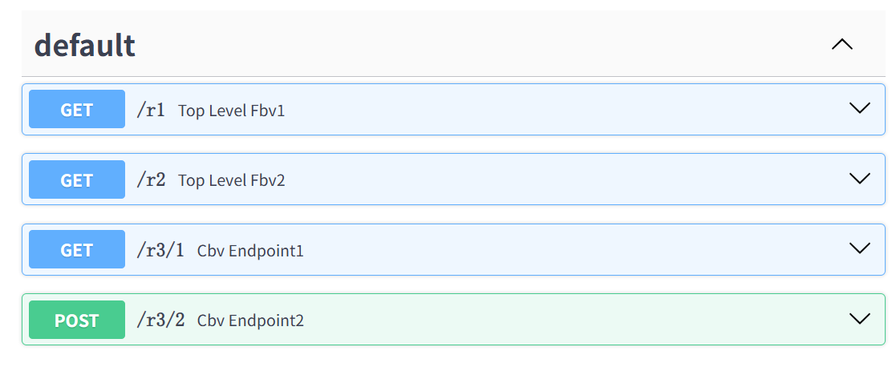
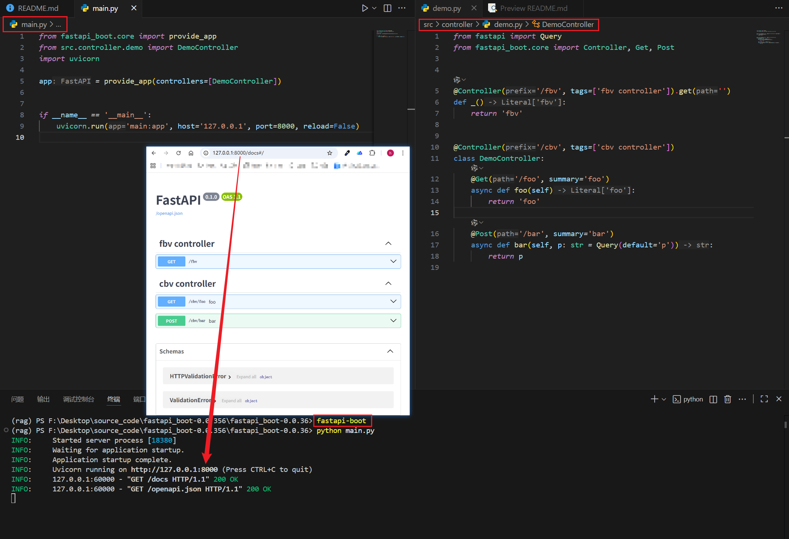

<div align='center' style="font-weight:bolder;font-size:60px">FastAPIBoot</div>


&emsp;&emsp;简单易用、功能强大的FastAPI工具库，支持CBV、依赖注入、声明式公共路由依赖和生命周期等写法，为**提高效率**而生。
> cbv: class based view

**特点**
- 📦**无缝集成FastAPI，开箱即用**，继承FastAPI的优点，支持通过`CLI`初始化。
- :racehorse:**支持`CBV`、`FBV`**，想套多少层就套多少层，路由层级关系更清晰。
- :white_check_mark: **践行`IOC`、`DI`、`AOP`**，开发更高效。
- :rainbow:**公共依赖提取**，结合多层`CBV`，避免`endpoint`中大量的`Depends`。
- :hammer:**丰富的工具**，生命周期、异常处理、中间件、`tortoise`工具。


## 1. 快速开始

### 1.1 安装 
```bash
pip install fastapi-boot
# 或者使用uv
uv add fastapi-boot
```

### 1.2 和FastAPI比较
:pushpin:要实现这些接口


1. 用fastapi_boot
```py
from typing import Annotated
from fastapi import Query
from fastapi_boot.core import Controller, Get, provide_app, Post
import uvicorn


# 提供FastAPI实例，不提供时会自动创建并返回
# provide_app中会收集app，并在fbv、cbv中自动挂载路由
app = provide_app()


# fbv, function-based view，参数和app.get一样
@Get('/r1')
def top_level_fbv1():
    return '/r1'


# fbv
@Controller('/r2').get('')
def top_level_fbv2():
    return '/r2'


# cbv, class based view
@Controller('/r3')
class CBVController:
    # 参数和app.get一样
    @Get('/1')
    async def cbv_endpoint1(self):
        return '/r3/1'

    # 参数和app.post一样
    @Post('/2')
    def cbv_endpoint2(self, q: Annotated[str, Query()]):
        return dict(query=q, path='/r3/2')


if __name__ == '__main__':
    uvicorn.run('main1:app', reload=True)
```

- 用fastapi

```py
from typing import Annotated
from fastapi import APIRouter, FastAPI, Query
import uvicorn


app = FastAPI()

@app.get('/r1')
def endpoint1():
    return '/r1'


router1 = APIRouter(prefix='/r2')

@router1.get('')
def endpoint2():
    return '/r2'

app.include_router(router1)


router2 = APIRouter(prefix='/r3')

@router2.get('/1')
async def endpoint3():
    return '/r3/1'

@router2.post('/2')
def endpoint4(q: Annotated[str, Query()]):
    return dict(query=q, path='/r3/2')

app.include_router(router2)


if __name__ == '__main__':
    uvicorn.run('main:app', reload=True)
```


### 1.3 :bulb:通过CLI生成：
```bash
fastapi-boot --host=localhost --port=8000 --reload --name=Demo
```



## 2. 所有API

```py
from fastapi_boot.core import (
    Bean,
    Inject,
    Injectable,
    ExceptionHandler,
    Lifespan,
    provide_app,
    on_app_ready,
    use_dep,
    use_http_middleware,
    use_ws_middleware,
    HTTPMiddleware,
    Lazy,
    Controller,
    Delete,
    Get,
    Head,
    Options,
    Patch,
    Post,
    Prefix,
    Put,
    Req,
    Trace,
    WS,
    Autowired,
    Component,
    Repository,
    Service,
)

# tortoise工具
from fastapi_boot.tortoise_util import Sql, Select, Update, Insert, Delete as SqlDelete
```
