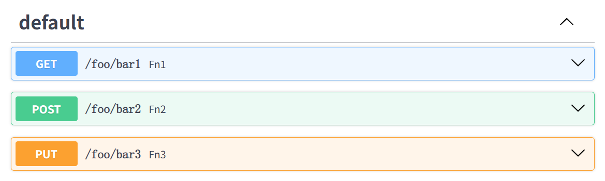
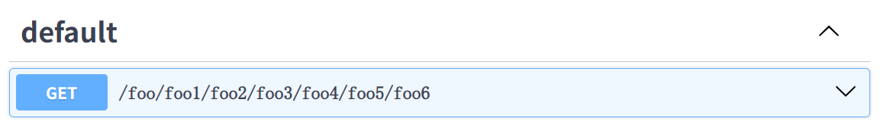

**将CBV同一层的endpoint的公共依赖提升至class层级，所有endpoint可共用**


:pushpin:**基本用法**
```python
import uvicorn
from fastapi_boot.core import Controller, Get, provide_app, Post, use_dep
from fastapi import Request

app = provide_app()


# 公共依赖的实现
def get_ua(request: Request):
    return request.headers.get('user-agent') or ''


@Controller('/foo')
class _:
    ua = use_dep(get_ua) # 提取依赖

    @Get('/bar1')
    def fn1(self):
        return self.ua

    @Post('/bar2')
    def fn2(self):
        return self.ua


if __name__ == '__main__':
    uvicorn.run('main:app', reload=True)
```

:pushpin:**`Prefix`**
作用：**隔离依赖**、**提取公共前缀**
场景：同一个路由下，A不需校验、B、C等需要校验

```python
# ...
from fastapi_boot.core import Controller, Get, provide_app, Post, use_dep, Prefix, Put
from fastapi import HTTPException, Query

# ...

# 验证并返回查询参数
def get_query_p(p: str = Query()):
    # 一些复杂逻辑...
    if len(p) < 5:
        raise HTTPException(400, '为什么p这么短')
    return p


@Controller('/foo')
class _:
    # 无法获取p，不受p中校验的影响
    @Get('/bar1')
    def fn1(self):
        return ''

    # 隔离
    @Prefix('/bar23')
    class PrefixCls:
        # 公共依赖，建议卸载所在类的顶层
        p = use_dep(get_query_p)

        @Post('/bar2')
        def fn2(self):
            return self.p

        @Put('/bar3')
        def fn3(self):
            return self.p
```

:bulb:当然，也可以：
```python
@Controller('/foo')
class _:
    p = use_dep(get_query_p)

    @Post('/bar2')
    def fn2(self):
        return self.p

    @Put('/bar3')
    def fn3(self):
        return self.p

    @Prefix()
    class PrefixCls:
        @Get('/bar1')
        def fn1(self):
            return ''
```


:pushpin:**多层嵌套**

```python
@Controller('/foo')
class _:
    @Prefix('/foo1')
    class _:
        @Prefix('/foo2')
        class _:
            @Prefix('/foo3')
            class _:
                @Prefix('/foo4')
                class _:
                    @Prefix('/foo5')
                    class _:
                        @Get('/foo6')
                        def _(self):
                            return ''
```


