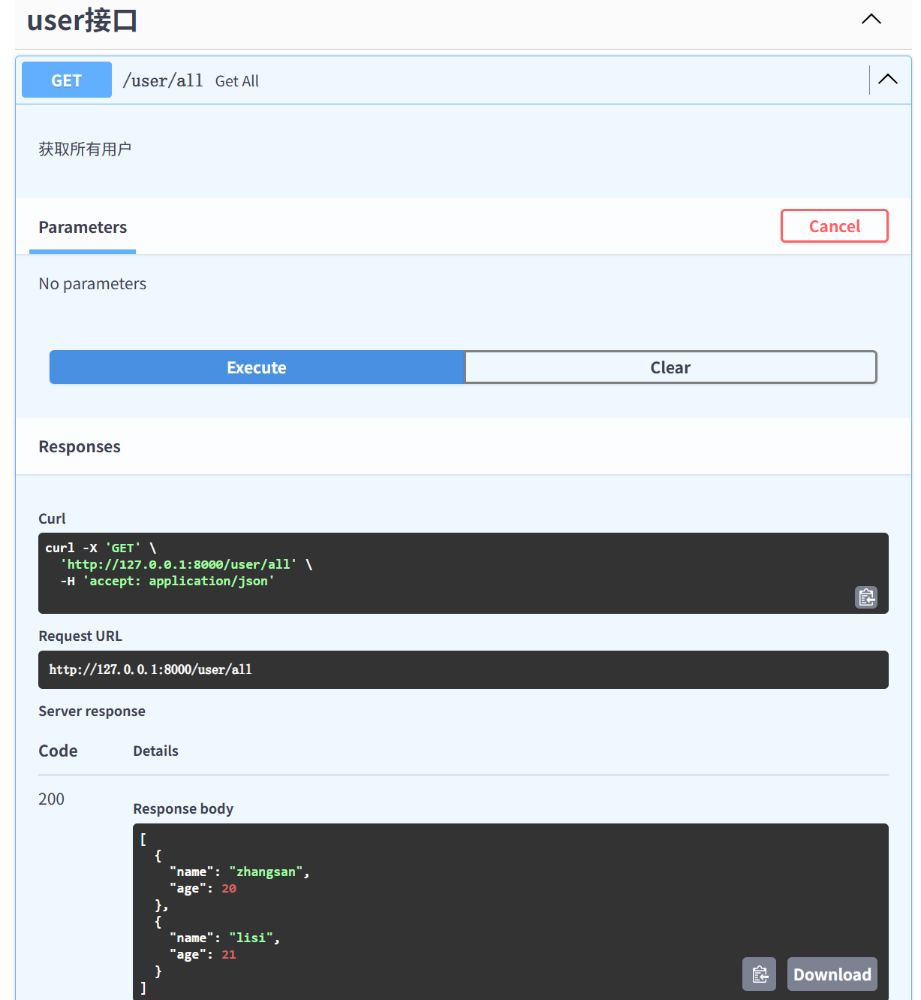

**类似SpringBoot、Nest的依赖注入**

:pushpin:**主要工具**
- `Controller`，必须**被导入、设置自动挂载**（**默认**）才能自动挂载到app上
- `Injectable`、`Service`、`Repository`、`Component`
- `Bean`，必须**被导入**才能收集依赖
- `Inject`、`AutoWired`，二者一样
- `Lazy`


:pushpin:**收集方式**
1. 方式：**（1）类型（2）类型+名字**
2. 写法
    - 被`Injectable`、`Service`、`Repository`、`Component`装饰的**类**，它们只有名字不同，**其他完全一样**，会把**类的实例**收集起来
    - 被`Bean`装饰的函数，会把**返回值**收集起来，**最好标注返回值类型**，如`def fn() -> User: ...`

```python
from fastapi_boot.core import Bean

# 类
@Bean
def fn1() -> int:
    return 1

@Injectable
class Cls1:...

# 类型 + 名字
@Bean('Integer1')
def fn2() -> int:
    return 1

@Component('cls2')
class Cls2:...
```

:pushpin:**注入方式**
1. 方式：**（1）类型（2）类型+名字**
2. 写法：
    - 使用`Inject`、`Autowired`，二者只有名字不同，其他完全一样
    - 被`Controller`、`Injectable`、`Service`、`Repository`、`Component`装饰的类的`__init__`方法中声明

```python
# 1. 直接注入
# 1.1 按类型
int1 = Inject(int)  # 写法1
int2 = Inject@int  # 写法2
int3 = int@Inject  # 写法3
int4 = Autowired(int)
int5 = Autowired@int
int6 = int@Autowired

# 1.2 按类型和名字
int7 = Inject(int, 'Integer1')  # 写法1
int8 = Inject.Qualifier('Integer1')@int  # 写法2
int9 = int@Inject.Qualifier('Integer1')  # 写法3

assert int1 == int2 == int3 == int4 == int5 == int6 == int7 == int8 == int9

# 2. __init__注入
@Service
class _:
    def __init__(self, int1: int, int11: Annotated[int, 'Integer1']):
        assert int1 == int11
```

```python
# Controller手动注入

# 类型
@Controller('/user', tags=['user接口'], auto_include=False)
class UserController:
    ...

user_router = Inject(APIRouter, UserController.__name__)
app.include_router(user_router)


# 类型+名字，1
@Controller('/user', tags=['user接口'], auto_include=False, dep_name='user接口controller')
class UserController:
    ...

user_router = Inject.Qualifier('user接口controller')@APIRouter
app.include_router(user_router)

# 2
@Controller('/fbv', auto_include=False, dep_name='fbv').get('')
def fbv():
    return 'ok'

app.include_router(Inject(APIRouter, 'fbv'))
```


:pushpin:**例子**
```js
.
├── main.py
└── src/
    └── user/
        ├── bean.py
        ├── controller.py
        ├── dao.py
        ├── model.py
        └── service.py
```

:one:`model.py`
```python
from pydantic import BaseModel


class User(BaseModel):
    name: str
    age: int
```

:two: `bean.py`
```python
from src.user.model import User
from fastapi_boot.core import Bean


zhangsan = User(name='zhangsan', age=20)
lisi = User(name='lisi', age=21)

@Bean
def provide_user_bean() -> User:
    return zhangsan

@Bean
def provide_users_bean() -> list[User]:
    return [zhangsan, lisi]

@Bean('zhangsan')
def provide_zhangsan_bean() -> User:
    return zhangsan
```


:three:`dao.py`
```python
from typing import Annotated
from fastapi_boot.core import Repository, Inject, Autowired
from src.user.model import User


@Repository
class UserDao:
    zhangsan1 = Inject(User)

    # 构造方法注入
    def __init__(self, zhangsan2: User, zhangsan3: Annotated[User, 'zhangsan'], users: list[User]) -> None:
        assert self.zhangsan1 == zhangsan2 == zhangsan3 == users[0]
        self.users = users

    def get_all(self):
        return self.users
```

:four:`service.py`
```python
from fastapi_boot.core import Service
from src.user.dao import UserDao


# 按类型和名字收集
@Service('user_service1')
class UserService:
    def __init__(self, user_dao: UserDao) -> None:
        self.user_dao = user_dao

    def get_all(self):
        return self.user_dao.get_all()
```

:five:`controller.py`
```py
from typing import Annotated
from fastapi_boot.core import Controller, Get
from src.user.model import User
from src.user.service import UserService


@Controller('/user', tags=['user接口'])
class UserController:
    def __init__(self, user_service: Annotated[UserService, 'user_service1']) -> None:
        self.user_service = user_service

    @Get('/all', description='获取所有用户', response_model=list[User])
    def get_all(self):
        return self.user_service.get_all()
```

:six:`main.py`
```py
import uvicorn
from fastapi_boot.core import provide_app

from src.user.bean import provide_user_bean, provide_users_bean, provide_zhangsan_bean
from src.user.controller import UserController

app = provide_app(controllers=[UserController], beans=[
                  provide_user_bean, provide_users_bean, provide_zhangsan_bean])


if __name__ == '__main__':
    uvicorn.run('main:app', reload=True)
```

:seven:效果



:pushpin:**Lazy注入**
场景：**项目启动之后**才能收集到
:one:`main.py`
```py
from contextlib import asynccontextmanager
from fastapi import FastAPI
import uvicorn
from fastapi_boot.core import provide_app, Bean

from src.user.controller import UserController


@asynccontextmanager
async def lifespan(_):
    @Bean
    def provide_str() -> str:
        return '我是字符串'
    yield

app = FastAPI(lifespan=lifespan)
provide_app(app=app, controllers=[UserController])


if __name__ == '__main__':
    uvicorn.run('main:app', reload=True)
```

:two:`controller.py`
```py
from fastapi_boot.core import Controller, Get, Lazy, Inject


@Controller('/user', tags=['user接口'])
class UserController:
    # 延迟注入并缓存
    s = Lazy(lambda: Inject(str))

    @Get('/s')
    def get_s(self):
        return self.s
```