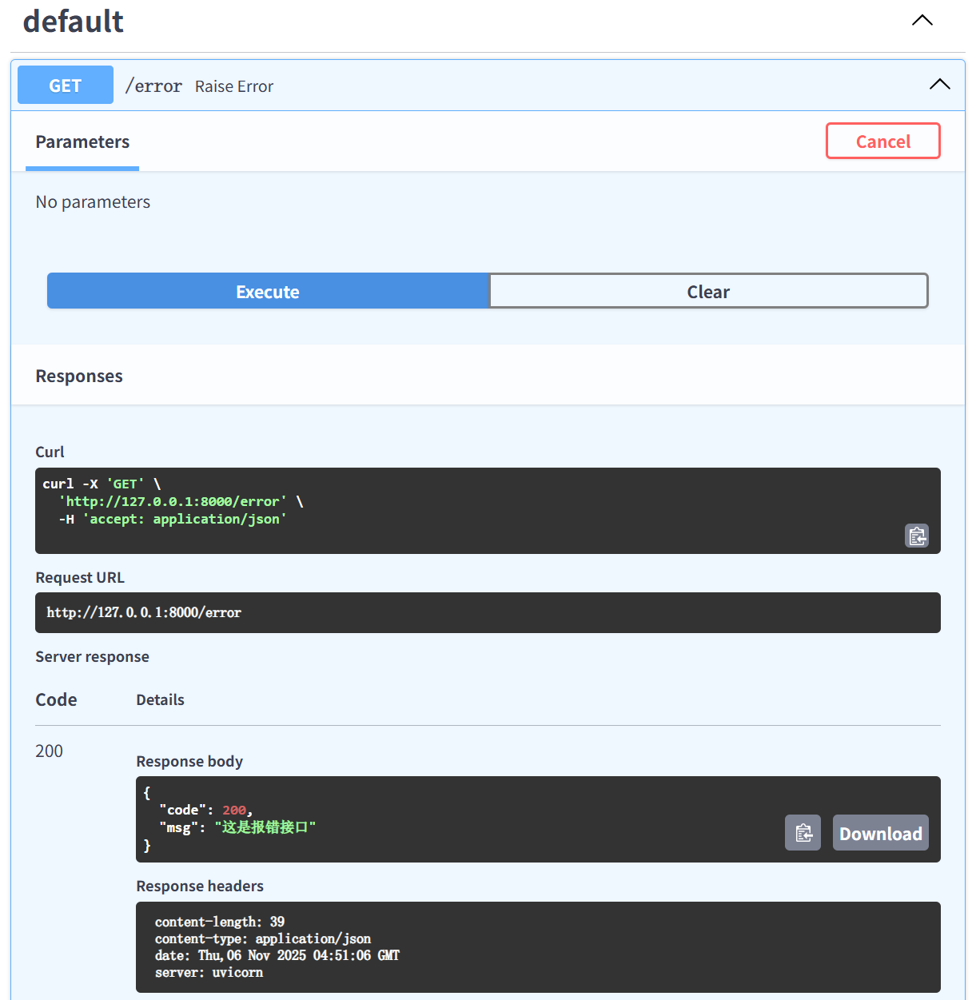
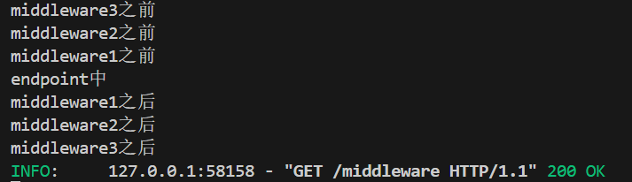
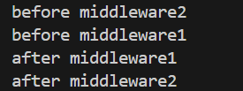
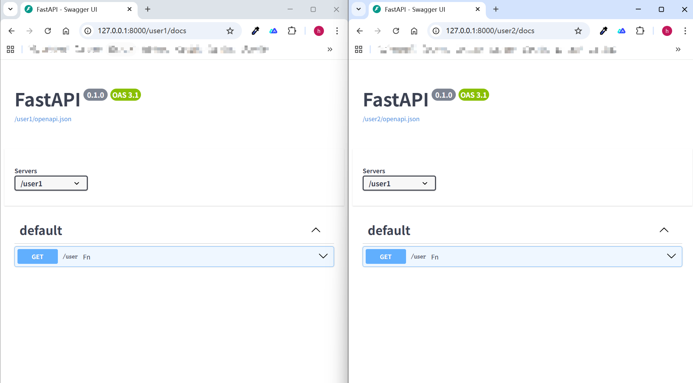

**一些工具和实践**

:white_check_mark:**配置和启动文件分开，避免被添加两次**

:hammer:**生命周期**
上一节中`Lazy`的例子可以改成

> ps: 似乎没啥用，既然都 手动导入 / 手动写在启动文件中了 那为什么不写在app初始化上；
> 自动导入时遗留下来的api，先留着吧

```py
from fastapi import FastAPI
import uvicorn
from fastapi_boot.core import provide_app, Bean, Lifespan

from src.user.controller import UserController

# 声明式写法，自动寻找FastAPI实例挂载
# 重复声明会覆盖
@Lifespan
async def lifespan(_):
    @Bean
    def provide_str() -> str:
        return '我是字符串'
    yield

app = FastAPI()
provide_app(app=app, controllers=[UserController])


if __name__ == '__main__':
    uvicorn.run('main:app', reload=True)
```

:hammer:**异常处理**
```py
from typing import Any
from fastapi import HTTPException, Request
from fastapi_boot.core import Controller, Get, ExceptionHandler


class CustomException(HTTPException):
    def __init__(self, status_code: int = 500, detail: Any = None, headers: dict[str, str] | None = None) -> None:
        super().__init__(status_code, detail, headers)


@ExceptionHandler(CustomException)
def handle_custom_exception(request: Request, exp: CustomException):
    # 日志...
    return dict(
        code=200,
        msg=exp.detail)


@Controller('/error')
class UserController:
    @Get()
    def raise_error(self):
        raise CustomException(detail='这是报错接口')
```




:hammer:**中间件**
:one: `HTTP`中间件
```py

from collections.abc import Callable
from fastapi import Request
from fastapi_boot.core import Controller, Get, HTTPMiddleware, use_http_middleware
# 全局中间件，可多层嵌套
@HTTPMiddleware
async def middleware1(request: Request, call_next: Callable):
    print('middleware1之前')
    ans = await call_next(request)
    print('middleware1之后')
    return ans


@HTTPMiddleware
class Middleware2:
    async def dispatch(self, request: Request, call_next: Callable):
        print('middleware2之前')
        res = await call_next(request)
        print('middleware2之后')
        return res


async def middleware3(request: Request, call_next: Callable):
    print('middleware3之前')
    ans = await call_next(request)
    print('middleware3之后')
    return ans


@Controller('/middleware')
class MiddlewareController:
    _ = use_http_middleware(middleware3)

    @Get()
    def raise_error(self):
        print('endpoint中')
        return 'ok'
```




:two: `WebSocket`中间件

```py
from collections.abc import Callable, Coroutine
from fastapi import WebSocket
from fastapi_boot.core import Controller, WS, use_ws_middleware

async def middleware1(websocket: WebSocket, call_next: Callable[[WebSocket], Coroutine]):
    print('before middleware1')
    await call_next(websocket)
    print('after middleware1')


async def middleware2(websocket: WebSocket, call_next: Callable[[WebSocket], Coroutine]):
    print('before middleware2')
    await call_next(websocket)
    print('after middleware2')


@Controller('/middleware')
class UserController:
    # only_message:是否仅有消息时才拦截，为False时连接等事件也会拦截
    _ = use_ws_middleware(middleware1, middleware2, only_message=True)

    @WS()
    async def f(self, websocket: WebSocket):
        try:
            await websocket.accept()
            while True:
                data = await websocket.receive_json()
                await websocket.send_json(data)
        except:
            pass
```




:hammer:**给当前模块所属的app添加回调函数**
```py
from fastapi import FastAPI
from fastapi_boot.core import on_app_ready


def foo(app: FastAPI):
    print('app ready')
    @app.get('/on_app_ready')
    def bar():
        return 'ok'

# 会在app准备好时执行，可多次调用
on_app_ready(foo)
```

:hammer:**子项目**

**可以用`app.mount`挂载子项目，它们的依赖是全局共享的**

```js
.
├── main.py
└── modules
    ├── user1
    │   ├── app.py
    │   └── controller.py
    └── user2
        ├── app.py
        └── controller.py
```

:one: `main.py`
```py
from fastapi import FastAPI
import uvicorn
from modules.user1.app import app as app1
from modules.user2.app import app as app2

app = FastAPI()
app.mount('/user1', app1)
app.mount('/user2', app2)


if __name__ == '__main__':
    uvicorn.run('main:app', reload=True)
```

:two: `modules.user1.app.py`
```py
from fastapi_boot.core import provide_app
from modules.user1.controller import UserController


app = provide_app(controllers=[UserController])
```


:three: `modules.user1.controller.py`
```py
from fastapi_boot.core import Controller, Get


@Controller('/user')
class UserController:
    @Get()
    def fn(self):
        return 'user1'
```

:four: `modules.user2.app.py`
```py
from fastapi_boot.core import provide_app
from modules.user2.controller import UserController


app = provide_app(controllers=[UserController])
```

:five: `modules.user2.controller.py`
```py
from fastapi_boot.core import Controller, Get


@Controller('/user')
class UserController:
    @Get()
    def fn(self):
        return 'user2'
```
**效果**
