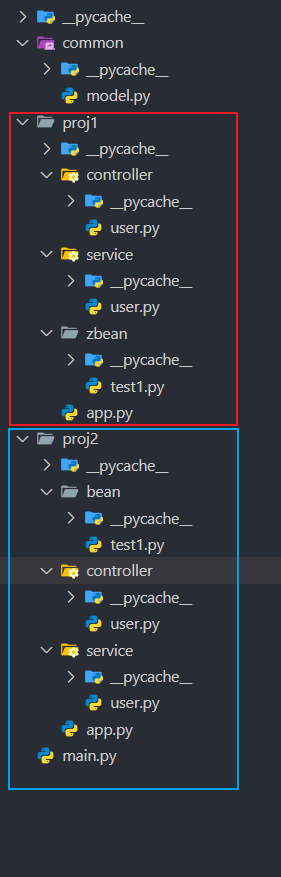
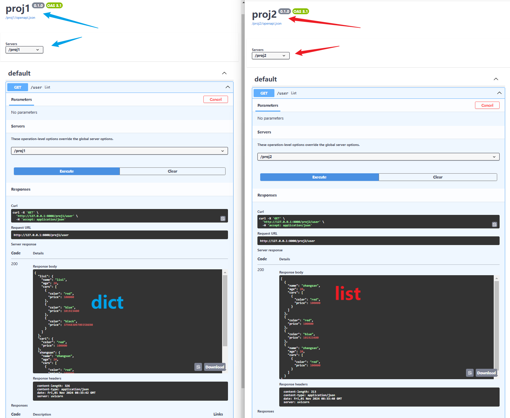
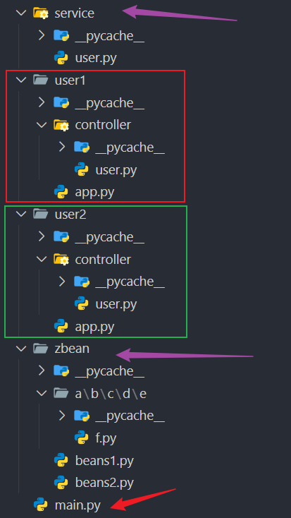
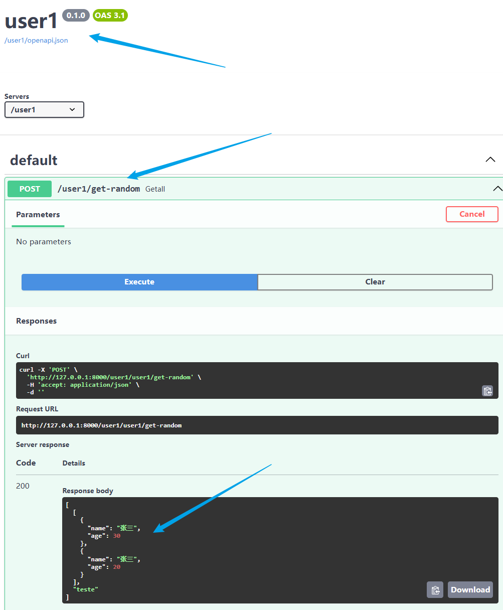
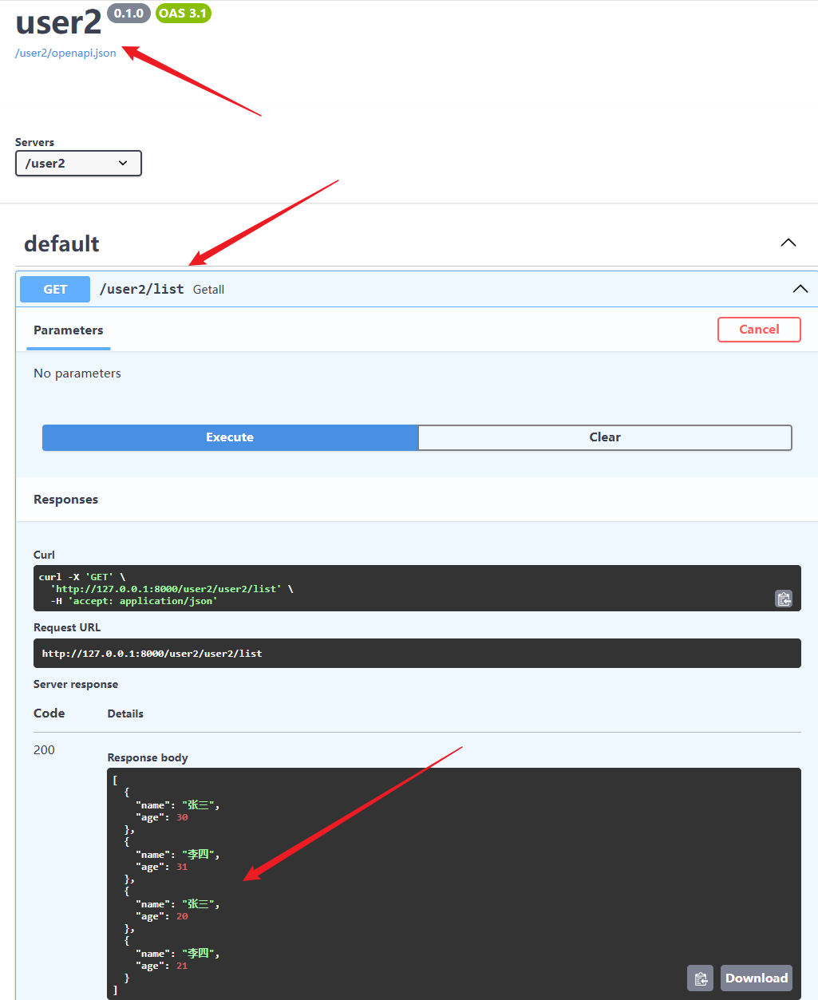
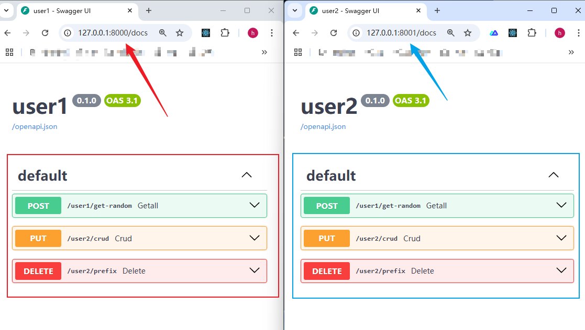
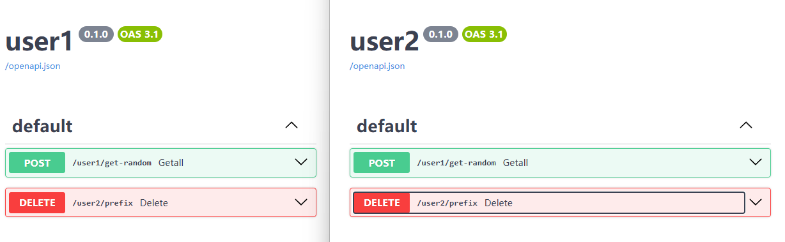
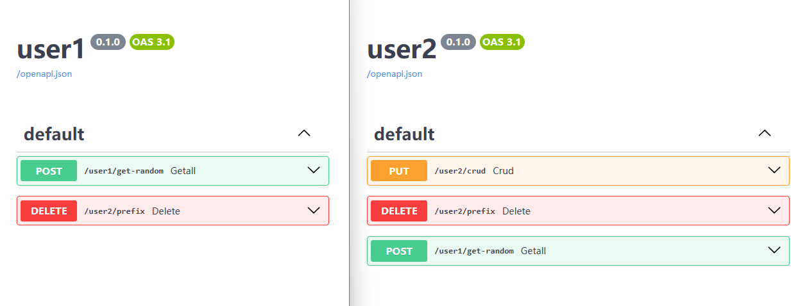

<h1 style="color:green">推荐使用</h1>

<style>
    .red{
        color:red;
        font-size:18px;
        font-weight:bold;
    }
</style>

## 1. 路由写法

### 基本视图

> 类视图：相关的视图写到一起，更直观；\
> 函数视图：单一请求；**控制器和请求的路径不能都是''，这点是 FastAPI 的报错** \
> **只要写在启动类`FastApiBoot`启动文件所在目录下，会<span class='red'>自动扫描</span>并挂载路由**

:::warning

-   尽量分模块、包写，把其他控制器、依赖写到启动类，我也不知道会出什么 bug :sweat_smile:

:::

目录：


:::code-group

```py [main.py]
from contextlib import asynccontextmanager
from fastapi import FastAPI
from fastapi.responses import RedirectResponse
from fastapi_boot import FastApiBootApplication, Config
import uvicorn


@asynccontextmanager
async def lifespan(app: FastAPI):
    FastApiBootApplication.app(app).build()
    # 其他配置，缺app会自己创建，缺app_config默认为空，缺config用默认项目配置
    # FastApiBootApplication.app(app).app_config().config(
    #     Config(exclude_scan_paths=["fastapi_boot", "hidden_bean"], include_scan_paths=["hidden_bean.a.b"])
    # ).build()
    # ! 传app和app_config同时使用时app_config失效，传app时对应配置应该在外面就设置好
    yield

app = FastAPI(lifespan=lifespan)

# 最简示例
# app = FastApiBootApplication.build()

@app.get("/")
def redirect():
    return RedirectResponse("/docs")

def main():
    # 1.
    uvicorn.run("main:app", reload=True)
    # 2.   os.system('uvicorn main:app --reload')
    # # 3.  使用fastapi命令行、uvicorn命令行
    # 如果使用1遇到连续扫描两次而导致路由丢失的情况，建议使用2或3启动l

if __name__ == "__main__":
    main()

```

```py [TestController.py]
from fastapi import Query

from fastapi_boot import Controller, Req, Get


# 类视图，Controller类继承APIRouter
@Controller("/test1", tags=["基本类视图"])
class Test1Controller:

    # 默认方法Get、请求路径''
    @Req(summary="req1")
    def req1(self):
        return "req1"

    @Get("/get1", summary="get1")
    def get1(self, q: str = Query()):
        return dict(code=200, msg="", data={"q": q})


# 函数视图
@Controller("/fbv").put("/")
def fbv():
    return "fbv"

```

:::

效果：


-   `app_config`参数和`FastAPI`的`__init__`的参数一样；
-   `config`的参数见<a href='#proj-config'>项目配置</a>

### 嵌套视图

> 类视图可以嵌套，内部的成员类需要用`Prefix`装饰器，表示前缀；

```py
from fastapi import Query
from fastapi_boot import Controller, Get, Prefix, Post


@Controller("/test1", tags=["嵌套类视图"])
class Test1Controller:

    @Get("/get1", summary="get1")
    def get1(self, q: str = Query()):
        return dict(code=200, msg="", data={"q": q})

    # 应该没人这么玩吧.
    @Prefix("/layer1")
    class Layer1:
        @Prefix("/layer2")
        class Layer2:
            @Prefix("/layer3")
            class Layer3:
                @Prefix("/layer4")
                class Layer4:
                    @Prefix("/layer5")
                    class Layer5:
                        @Prefix("/layer6")
                        class Layer6:
                            @Prefix("/layer7")
                            class Layer7:
                                @Prefix("/layer8")
                                class Layer8:
                                    @Prefix("/layer9")
                                    class Layer9:
                                        @Prefix("/layer10")
                                        class Layer10:
                                            @Prefix("/layer11")
                                            class Layer11:
                                                @Prefix("/layer12")
                                                class Layer12:
                                                    @Prefix("/layer13")
                                                    class Layer13:
                                                        @Prefix("/layer14")
                                                        class Layer14:
                                                            @Prefix("/layer15")
                                                            class Layer15:
                                                                @Prefix("/layer16")
                                                                class Layer16:
                                                                    @Prefix("/layer17")
                                                                    class Layer17:
                                                                        @Prefix("/layer18")
                                                                        class Layer18:
                                                                            @Prefix("/layer19")
                                                                            class Layer19:
                                                                                @Prefix("/layer20")
                                                                                class Layer20:
                                                                                    @Post("/layer-route")
                                                                                    def layer_route(
                                                                                        self,
                                                                                    ):
                                                                                        return "You did it!"

```

效果：


## 2. 请求依赖

### `usedep`

-   位置：控制器的**静态属性**上，不要放在控制器的`__init__`方法上，因为`__init__`的所有参数都会被认为是项目中需要注入的依赖；
-   扫描时会自动为控制器下**子路由**注入公共依赖，从而避免在有关的每个请求方法上都写

> 成员类的`self`不受父类`self`属性的影响，可以用来提取公共依赖、排除父类依赖；
> 当然，成员类也可以有自己的依赖，并且不会影响父类、同级类和子类

-   下面的例子中，`/test1/foo`和`/test1/bar`都有两个依赖，分别获取`user-agent`和简单验证查询参数`p`，而`/test1/baz`不能获取也不受限制

```py
from fastapi import HTTPException, Query, Request

from fastapi_boot import Controller, Get, usedep, Post, Prefix


def get_user_agent(request: Request):
    return request.headers.get("user-agent")


def verify_params(p: str = Query()):
    if len(p) < 3:
        raise HTTPException(status_code=401, detail="p太短")
    return p


# 类视图，Controller类继承APIRouter
@Controller("/test1", tags=["基本类视图"])
class Test1Controller:
    user_agent = usedep(get_user_agent) # [!code ++]
    p = usedep(verify_params) # [!code ++]

    @Get("/foo")
    def foo(self):
        return dict(p=self.p, userAgent=self.user_agent)

    @Post("/bar")
    def bar(self):
        return dict(p=self.p, userAgent=self.user_agent)

    @Prefix()
    class Another:
        @Get("baz")
        def baz(self):
            return "success"
```

:::details 效果
`main.py`应该在外面，画错了...


<div style='height:20px;background-color:transparent'></div>


<div style='height:20px;background-color:transparent'></div>


:::

### 注意事项

:::warning 注意事项

-   由于每次请求都会执行控制器的`__init__`方法来更新请求依赖，所以尽量不要在控制器的`__init__`方法中执行其他逻辑，建议不写`__init__`，**请求依赖写到控制器的静态属性上，项目依赖写到控制器的静态属性**或外面；
-   其他项目依赖的`__init__`方法没有限制，只会初始化一次；

:::

:::code-group

```py [一个小坑]
from fastapi import WebSocket, WebSocketDisconnect
from fastapi_boot import Socket, Controller


@Controller("/chat")
class ChatController:

    def __init__(self) -> None:
        # 这里每次请求都会重置self.websocket_list，所以它只有当前请求的websocket，只能把自己发的消息消息广播给自己
        self.websocket_list: list[WebSocket] = [] # [!code error]

    @Socket()
    async def chat(self, websocket: WebSocket):
        await websocket.accept()
        self.websocket_list.append(websocket)
        while True:
            try:
                msg = await websocket.receive_text()
            except WebSocketDisconnect:
                self.websocket_list.remove(websocket)
                print(f"{websocket} 断开连接")
                break
            print(f"客户端发来消息：{msg}")
            for ws in self.websocket_list:
                print(ws)
                await ws.send_text(msg)
```

```py [解决方法]
# 也可以写到外面，建议还是高内聚低耦合
websocket_list: list[WebSocket] = [] # [!code warning]

@Controller("/chat")
class ChatController:
    websocket_list: list[WebSocket] = [] # [!code ++]

    @Socket()
    async def chat(self, websocket: WebSocket):
        # ...
```

:::

## 3. 项目依赖及注入

### 收集依赖

> 收集依赖：扫描时进行 \
> &emsp;`Injectable`，为了语义化，重命名导出了`Service`、`Repository`、`Component`，这四个一模一样； \
> &emsp;还有一个`Bean`

```py
from fastapi_boot import Service, Repository, Component, Injectable

# 语义化的
@Service
class AnimalService:...
@Repository
class AnimalDAO: ...
@Component
class Xxx: ...
# 更普遍的
@Injectable
class Xxxx: ...


# 或者也可以按依赖名收集，其他的类似
@Service('animal-service1')
class AnimalService:...
# 在这几个上使用依赖名收集似乎没什么用，到Bean上就有用了
```

```py
from pydantic import BaseModel
from fastapi_boot import Bean

class Animal:
    def __init__(self, name: str, age: int = 9) -> None:
        self.name = name
        self.age = age


# 这样就收集了一个类型为Animal的依赖
# Bean装饰的函数如果不写返回值类型，会用type(return_value)推断
@Bean
def get_animal() -> Animal:
    return Animal("animal", 10)


# 使用命名依赖收集多个同类型的依赖，并在之后指定按依赖名注入
class User(BaseModel):
    name: str
    age: int


# name为zhangsan的User
@Bean("zhangsan")
def get_user1():
    return User(name="zhangsan", age=20)

# name为lisi的User
@Bean("lisi")
def get_user2():
    return User(name="lisi", age=21)

# name为wangwu的User
@Bean("wangwu")
def get_user3():
    return User(name="wangwu", age=22)
```

### 注入依赖

> 注入依赖： \
> `Inject`以及它的重命名导出`Autowired`，一模一样；\
> （1）如果在模块顶层或者作为类的静态属性，会在扫描时进行； \
> （2）如果在请求时才运行的函数（`Controller`的`__init__`方法、请求映射方法）中，则请求时才注入（不建议，可能会拖慢速度）；

#### 按类型

-   如果要注入之前的`Animal`，没写名需要按类型注入，写了名按类型和依赖名都行；
-   三种位置注入；
-   可以直接调用或使用`@`运算符进行注入；

:::code-group

```py [service/animal.py]
from fastapi_boot import Service, Inject, Autowired

from bean.beans import Animal

# 模块顶层注入
animal1: Animal = Inject(Animal)
animal2: Animal = Autowired @ Animal
animal3: Animal = Animal @ Inject


@Service
class AnimalService:
    # 静态属性注入
    animal4: Animal = Autowired(Animal)
    animal5: Animal = Inject @ Animal
    animal6: Animal = Animal @ Autowired

    # __init__方法注入
    def __init__(self, animal7: Animal, animal8: Animal):
        self.animal7: Animal = animal7
        self.animal8: Animal = animal8
        self.animal9: Animal = Inject @ Animal

    def is_animal_same(self):
        # 注入的都是同一个Animal实例，返回True
        return (
            animal1
            == animal2
            == animal3
            == self.animal4
            == self.animal5
            == self.animal6
            == self.animal7
            == self.animal8
            == self.animal9
        )
```

```py [controller/animal.py]
from fastapi_boot import Autowired, Get, Controller
from service.animal import AnimalService

@Controller("/animal", tags=["依赖注入"])
class UserController:
    animal_service = Autowired(AnimalService)

    @Get()
    def foo(self):
        return self.animal_service.is_animal_same()
```

:::

目录：

效果：


#### 按依赖名

:::code-group

```py [service/user.py]
from typing import Annotated
from fastapi_boot import Service, Inject, Autowired

from bean.beans import User

# 模块顶层注入
user1: User = Autowired(User, "zhangsan")
user2: User = Inject.Qualifier("lisi") @ User
user3: User = User @ Autowired.Qualifier("wangwu")


@Service
class UserService:
    # 静态属性注入
    user4: User = Inject(User, "zhangsan")
    user5: User = Autowired.Qualifier("lisi") @ User
    user6: User = User @ Inject.Qualifier("wangwu")

    # __init__方法注入
    def __init__(self, user7: Annotated[User, "zhangsan"]):
        self.user7: User = user7
        self.user8: User = Inject.Qualifier("lisi") @ User
        self.user9: User = User @ Autowired.Qualifier("wangwu")

    def is_user_same(self):
        return (
            user1 == self.user4 == self.user7
            and user2 == self.user5 == self.user8
            and user3 == self.user6 == self.user9
        ) # True

```

```py [controller/user.py]
from fastapi_boot import Get, Controller

from service.user import UserService


@Controller("/user", tags=["依赖注入"])
class UserController:
    def __init__(self, user_service: UserService) -> None:
        self.user_service = user_service

    @Get()
    def foo(self):
        return self.user_service.is_user_same()

```

:::
目录：

效果：


#### tips

1. `Bean`装饰的函数
    - 如果有泛型，确保**以泛型方式**写上`return_annotation`，并按泛型类型注入；
    - 如果不写返回值类型注解，只能推断出外层类型，按类型注入可能会重复，从而报错；
    - 当然也可以写依赖名，按依赖名注入，**遇到复杂点的类型建议通过依赖名注入**；

```py
# bean/beans.py

# 如果他不写返回值类型，只能推断出list，就和后面的两个重复了，之后按类型list注入的时候不知道注入谁
@Bean
def get_str_list() -> list[str]:
    return ["1", "2", "3"]


@Bean
def get_int_str() -> list[int]:
    return [1, 2, 3]


@Bean
def get_animal_list(animal: Animal) -> list[Animal]:
    return [animal for _ in range(3)]

# controller/user.py
@Controller("/animal", tags=["依赖注入"])
class UserController:
    str_list = Inject @ list[str]
    int_list = Inject @ list[int]
    animal_list = Inject @ list[Animal]

    @Get()
    def foo(self):
        return [*self.str_list, *self.int_list, *self.animal_list]
```

效果：


2. 依赖链
    - 收集到的依赖、`Bean`装饰的函数，在实例化、执行的过程中，会尝试注入形参中的依赖；
    - <span class='red'>注意循环引用问题</span>

:::code-group

```py [bean/beans.py]
from typing import Annotated, TypeAlias
from pydantic import BaseModel
from fastapi_boot import Bean


class Biology(BaseModel):
    name: str
    age: int

class Human(Biology): ...

@Bean("zhangsan")
def get_zhangsan():
    return Human(name="zhangsan", age=20)

@Bean("lisi")
def get_lisi():
    return Human(name="lisi", age=21)

# 尽量不要把类型别名的定义放在使用之后，可能会找不到
BiologyList: TypeAlias = list[Biology]

# 注入前面的zhangsan和后面的dog、BiologyList
# 因为前面有个lisi也是Human，所以zhangsan使用依赖名注入
# 而dog只有一个，使用类型注入
@Bean("lisi")
def get_list(zhangsan: Annotated[Human, "zhangsan"], dog: "Dog") -> BiologyList: # [!code ++]
    return [zhangsan, dog]

class Dog(Biology):
    owner: Human

@Bean
def get_dog(owner: Annotated[Human, "zhangsan"]):
    return Dog(name="wangcai", age=2, owner=owner)
```

```py [service/user.py]
from fastapi_boot import Service, Inject
from bean.beans import BiologyList


@Service
class UserService:
    ls = Inject @ BiologyList

    def test(self):
        return self.ls
```

```py [controller/user.py]
from fastapi_boot import Get, Controller
from service.user import UserService


@Controller("/biology-list", tags=["依赖注入"])
class UserController:

    def __init__(self, user_service: UserService) -> None:
        self.user_service = user_service

    @Get()
    def get_list(self):
        return self.user_service.test()
```

:::
效果：


#### 处处可依赖注入

:::code-group

```py [bean/beans.py]
from typing import Annotated, Generic, TypeVar
from pydantic import BaseModel
from fastapi_boot import Bean


class Biology(BaseModel):
    name: str
    age: int

class Human(Biology): ...

@Bean("zhangsan")
def get_zhangsan():
    return Human(name="zhangsan", age=20)

@Bean("lisi")
def get_lisi():
    return Human(name="lisi", age=21)

@Bean
def get_list(zhangsan: Annotated[Human, "zhangsan"], dog: "Dog[int]") -> "Res[str]": # [!code ++]
    return Res(records=[zhangsan, dog])


# 仅演示泛型依赖注入，无实际类型约束
T = TypeVar("T")

# 要实例化的类Dog放到get_dog前面，，不然执行时找不到
class Dog(Biology, Generic[T]):
    owner: Human

@Bean
def get_dog(owner: Annotated[Human, "zhangsan"]) -> "Dog[int]": # [!code ++]
    return Dog(name="wangcai", age=2, owner=owner)

class Res(BaseModel, Generic[T]):
    records: list[Biology]
```

```py [service/user.py]
from typing import Annotated
from bean.beans import Human, Res
from fastapi_boot import Service, Component, Inject


@Service
class UserService:
    res = Inject @ Res[str]

    def __init__(self, a: "A", lisi: Annotated[Human, "lisi"]) -> None:
        self.a = a
        self.lisi = lisi

    def test(self):
        return self.a.name, self.res.records, self.lisi

@Component
class A:
    name = "A"
```

```py [controller/user.py]
from bean.beans import Dog, Res
from fastapi_boot import Get, Controller, Injectable, Autowired
from service.user import UserService


@Controller("/inject-test", tags=["依赖注入"])
class UserController:

    def __init__(self, user_service: UserService, res: Res[str], dog: Dog[int]) -> None:
        self.user_service = user_service
        self.b = Autowired @ B
        self.res = res
        self.dog = dog

    @Get()
    def get_list(self):
        return self.user_service.test(), self.b.name, self.res, self.dog

@Injectable
class B:
    name = "B"
```

:::

效果：


## 4. 项目配置<span id='proj-config'></span>及多模块挂载

### 配置

```py
app = FastApiBootApplication.app_config(title='foo').config(Config(exclude_scan_paths=["fastapi_boot"])).build()

# Config类如下
@dataclass
class Config:
    need_pure_api: Annotated[bool, "是否删除自带的api"] = False
    scan: Annotated[bool, "是否需要扫描，不扫描的话需要手动挂载路由"] = True
    scan_timeout_second: Annotated[int, "扫描超时时间，超时未找到报错"] = 10
    exclude_scan_paths: Annotated[list[str], "忽略扫描的模块或包在项目中的点路径"] = field(default_factory=list)
    include_scan_paths: Annotated[list[str], "额外扫描的模块或包在项目中的点路径"] = field(default_factory=list)
    max_scan_workers: Annotated[int, "扫描最大线程数，按照ThreadPoolExecutor的约定"] = field(
        default=min(32, (os.cpu_count() or 1) + 4)
    )
```

-   排除的路径将不会收集依赖，额外扫描的路径会收集依赖
-   自带的 api 包括`/openapi.json`、`/docs`、`/docs/oauth2-redirect`、`/redoc`

### 多模块

下面的例子中，`common`是公共模型模块，`proj1`和`proj2`是两个子应用，挂载到`main`。


**两个子模块的配置基本一样**
:::code-group

```py [bean]
# zbean是为了测试不同扫描顺序
from typing import Annotated
from fastapi_boot import Bean

from common.model import Car, User


@Bean("zhangsan")
def get_zhangsan(car: Annotated[Car, "car1"]):
    return User(name="zhangsan", age=20, cars=[car])

@Bean("lisi")
def get_lisi(car1: Annotated[Car, "car1"], car2: Annotated[Car, "car2"], car3: Annotated[Car, "car3"]) -> User:
    return User(name="lisi", age=20, cars=[car1, car2, car3])

@Bean("car1")
def get_car1():
    return Car(color="red", price=100000.0)

@Bean("car2")
def get_car2():
    return Car(color="blue", price=101923400.0)

@Bean("car3")
def get_car3():
    return Car(color="black", price=37948309709358691.0)
```

```py [proj1 service]
from typing import Annotated
from common.model import Car, User
from fastapi_boot import Service, Inject, Autowired


lisi = User @ Inject.Qualifier("lisi")

@Service
class UserService:
    car1 = Autowired(Car, "car1")

    def __init__(self, zhangsan: Annotated[User, "zhangsan"]):
        self.zhangsan = zhangsan
        self.car2 = Inject(Car, "car2")

    def get_lisi(self):
        return dict(lisi=lisi, car1=self.car1, zhangsan=self.zhangsan, car2=self.car2)

```

```py [proj2 service]
from typing import Annotated
from common.model import Car, User
from fastapi_boot import Service, Inject, Autowired


zhangsan = Autowired(User, "zhangsan")

@Service
class UserService:
    car1 = Inject.Qualifier("car1") @ Car

    def __init__(self, car2: Annotated[Car, "car2"]) -> None:
        self.car2 = car2
        self.zhangsan = Inject(User, "zhangsan")

    def get_lisi(self):
        return [zhangsan, self.car1, self.car2, self.zhangsan]
```

```py [controller]
from fastapi_boot import Controller, Get
from proj1.service.user import UserService # proj2的从proj2导入


@Controller("/user")
class UserController:
    def __init__(self, user_service: UserService) -> None:
        self.user_service = user_service

    @Get()
    def list(self):
        return self.user_service.get_lisi()
```

```py [app1]
from fastapi_boot import FastApiBootApplication


app = FastApiBootApplication.app_config(title="proj1").build()
```

```py [app2]
from fastapi_boot import FastApiBootApplication


app = FastApiBootApplication.app_config(title="proj2").build()
```

:::

:::code-group

```py [common.py]
from pydantic import BaseModel


class User(BaseModel):
    name: str
    age: int
    cars: list["Car"]

class Car(BaseModel):
    color: str
    price: float

class Animal(BaseModel):
    name: str
    age: int
```

```py [main.py]
from fastapi import FastAPI
from proj1.app import app as app1
from proj2.app import app as app2
import uvicorn


app = FastAPI(title="多模块测试")

app.mount("/proj1", app1)
app.mount("/proj2", app2)

def main():
    uvicorn.run("main:app", reload=True)

if __name__ == "__main__":
    main()
```

:::

:::details 效果

:::

### 非应用模块依赖的导入

-   一些公共的模块，不需要创建应用，公共模块之间可以互相注入依赖（注意循环引用问题），但**不能注入其他应用的依赖**，最终在其他应用中被注入使用；
-   下面的例子中`user1`应用和`user2`应用都使用了`service`模块中的依赖`UserService`，而`UserService`使用了`zbean`模块中的一些`User`；
-   通过在`user1`应用和`user2`应用中指定额外扫描路径`service`，他俩都能注入`UserService`了；
-   在`user1`中排除扫描`zbean`，但额外扫描`zbean.a.b.c`，所以`user1`应用中可以注入`TestE`，而不能注入那些 Bean；



> zbean 模块
> :::code-group

```py [bean1.py]
from pydantic import BaseModel
from fastapi_boot import Bean


class User(BaseModel):
    name: str
    age: int

@Bean('zhangsan')
def get_user1():
    return User(name='张三', age=30)

@Bean('lisi')
def get_user2():
    return User(name='李四', age=31)
```

```py [bean2.py]
from pydantic import BaseModel
from fastapi_boot import Bean


class User(BaseModel):
    name: str
    age: int

@Bean('zhangsan')
def get_user1():
    return User(name='张三', age=20)

@Bean('lisi')
def get_user2():
    return User(name='李四', age=21)
```

```py [f.py]
from fastapi_boot import Component


@Component
class TestE:
    name = "teste"
```

:::

> service 模块

:::code-group

```py [UserService]
import random
from typing import Annotated
from fastapi_boot import Service, Inject

from zbean.beans1 import User
from zbean.beans2 import User as User1


@Service
class UserService:
    zhangsan1 = User1 @ Inject.Qualifier("zhangsan")

    def __init__(self, zhangsan: Annotated[User, "zhangsan"], lisi1: Annotated[User1, "lisi"]) -> None:
        self.zhangsan = zhangsan
        self.lisi = Inject.Qualifier("lisi") @ User
        self.lisi1 = lisi1

    def getall(self):
        return [self.zhangsan, self.lisi, self.zhangsan1, self.lisi1]

    def get_random_one(self):
        return [self.zhangsan, self.zhangsan1] if random.randint(1, 2) == 1 else [self.lisi, self.lisi1]
```

:::

> user1

:::code-group

```py [user.py]
from fastapi_boot import Controller, Post, Inject

from service.user import UserService
from zbean.a.b.c.d.e.f import TestE


@Controller("/user1")
class UserController:

    def __init__(self, user_service: UserService) -> None:
        self.user_service = user_service
        self.teste = TestE @ Inject

    @Post("get-random")
    def getall(self):
        return self.user_service.get_random_one(), self.teste.name
```

```py [app.py]
from fastapi_boot import FastApiBootApplication, Config

config = Config(exclude_scan_paths=["zbean"], include_scan_paths=["zbean.a.b.c", "service"]) # [!code ++]
app = FastApiBootApplication.config(config).app_config(title="user1").build() # [!code ++]
```

:::

> user2

:::code-group

```py [user.py]
from fastapi_boot import Controller, Get
from service.user import UserService


@Controller("/user2")
class UserController:
    def __init__(self, user_service: UserService) -> None:
        self.user_service = user_service

    @Get("list")
    def getall(self):
        return self.user_service.getall()
```

```py [app.py]
from fastapi_boot import FastApiBootApplication, Config

config = Config(include_scan_paths=["service"]) # [!code ++]
app = FastApiBootApplication.config(config).app_config(title="user2").build() # [!code ++]
```

:::

> 启动文件

:::code-group

```py [main.py]
from fastapi import FastAPI
import uvicorn
from user1.app import app as app1
from user2.app import app as app2


app = FastAPI()
app.mount("/user1", app1)
app.mount("/user2", app2)

if __name__ == "__main__":
    uvicorn.run("main:app", reload=True)
```

:::

效果：



### 一路由多用

-   `Controller`中使用`use_router`捕获路由，在其他应用中挂载即可

:::code-group

```py [user1]
from fastapi_boot import Controller, Post, Inject, use_router
from service.user import UserService


@Controller("/user1")
class UserController:
    router = use_router() # [!code ++]

    def __init__(self, user_service: UserService) -> None:
        self.user_service = user_service

    @Post("get-random")
    def getall(self):
        return self.user_service.get_random_one()
```

```py [user2]
from typing import Annotated
from fastapi_boot import Controller, Delete, Prefix, Put, use_router
from user2.service.user import UserService
from zbean.beans2 import User


@Controller("/user2")
class UserController:
    router = use_router() # [!code ++]

    def __init__(self, user_service: UserService, zhangsan: Annotated[User, "zhangsan"]) -> None:
        self.user_service = user_service
        self.zhangsan = zhangsan

    @Put("/crud")
    def crud(self):
        return (
            self.user_service.insert(),
            self.user_service.find_ond(),
            self.user_service.update_one(),
            self.user_service.delete_one(),
            self.zhangsan,
        )

    @Prefix("/prefix")
    class PrefixCls:
        @Delete()
        def delete(self):
            return True
```

```py [app1]
from fastapi_boot import FastApiBootApplication, Config

# 默认自动扫描
config = Config(exclude_scan_paths=["zbean"], include_scan_paths=["zbean.a.b.c", "service"])
app = FastApiBootApplication.config(config).app_config(title="user1").build()

# 这里要等app创建完毕再导入，不然会报错
from user2.controller.user import UserController as U2

# 挂载user2的一个路由
app.include_router(U2.router)
```

```py [app2]
from fastapi import FastAPI
from fastapi_boot import FastApiBootApplication, Config

# 设置scan=False，不扫描
config = Config(include_scan_paths=["service", "zbean.beans2", "dao.user"], scan=False)
app = FastApiBootApplication.config(config).app_config(title="user2").build()

# 手动导入user2和user1的路由并挂载
from user1.controller.user import UserController as U1
from user2.controller.user import UserController

app.include_router(U1.router)
app.include_router(UserController.router)
```

```py [main]
import uvicorn
from multiprocessing import Process
from user1.app import app as app1
from user2.app import app as app2


def task(name: str, port: int):
    uvicorn.run(f"main:{name}", port=port, reload=True)


if __name__ == "__main__":
    # 多进程微服务
    p1 = Process(
        target=task,
        args=("app1", 8000,),
    )
    p2 = Process(
        target=task,
        args=("app2", 8001,),
    )
    p1.start()
    p2.start()
    p1.join()
    p2.join()
```

:::

效果：

它们都能调用对方接口；

-   或者也可以给`use_router`指定要提取哪些路径。不需要加`Controller`的前缀；
    比如之前的`user2`中改成如下：

```py
@Controller("/user2")
class UserController:
    # 参数是个*args，后续如果要加其他参数，可能会调整为列表
    router = use_router() # [!code --]
    router = use_router("prefix") # [!code ++]
# ...
```

然后就变成这样了，user2 自己的路由也剩一个了，因为 user2 也用了导入的路由而不是自动扫描的

现在开启`app2`的自动扫描，并注释掉手动导入（不管也行，FastAPI 会警告 id 一样，会去重，只算一个），再看看效果：

```py [app2]
config = Config(include_scan_paths=["service", "zbean.beans2", "dao.user"])
app = FastApiBootApplication.config(config).app_config(title="user2").build()

from user1.controller.user import UserController as U1

# from user2.controller.user import UserController
app.include_router(U1.router)
# app.include_router(UserController.router)
```


回来了

## 5. 所有 API

```py
from fastapi_boot.model.scan import Config
from .core.decorator import Controller, Bean, Injectable, Prefix
from .fastapiboot import FastApiBootApplication
from .core.decorator import (
    Injectable as Service,
    Injectable as Repository,
    Injectable as Component,
)
from .core.inject import Inject
from .core.inject import Inject as Autowired
from .core.usedep import usedep
from .core.mapping import (
    Req,
    Get,
    Post,
    Put,
    Delete,
    Options,
    Head,
    Patch,
    Trace,
    WebSocket as Socket,
)
from .enums import RequestMethodEnum as RequestMethod
```

<span style='color:orange;font-size:20px;font-weight:bold'>更多功能(bug)待探索...</span>
