<style>
    .red{
        color:red;
        font-size:18px;
        font-weight:bold;
    }
</style>

## 1. 路由写法

### 基本视图

> 类视图：相关的视图写到一起，更直观；\
> 函数视图：单一请求；**控制器和请求的路径不能都是''，这点是 FastAPI 的报错** \
> **只要写在启动类`FastApiBoot`启动文件所在目录下，会<span class='red'>自动扫描</span>并挂载路由**

:::warning

-   尽量分模块、包写，把其他控制器、依赖写到启动类，我也不知道会出什么 bug :sweat_smile:

:::

目录：
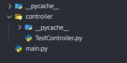

:::code-group

```py [main.py]
from contextlib import asynccontextmanager
from fastapi import FastAPI
from fastapi.responses import RedirectResponse
from fastapi_boot import FastApiBootApplication
import uvicorn


@asynccontextmanager
async def lifespan(app: FastAPI):
    FastApiBootApplication.run_app(app)
    yield

app = FastAPI(lifespan=lifespan)

@app.get("/")
def redirect():
    return RedirectResponse("/docs")

def main():
    uvicorn.run("main:app", reload=True)

if __name__ == "__main__":
    main()
```

```py [TestController.py]
from fastapi import Query

from fastapi_boot import Controller, Req, Get


# 类视图，Controller类继承APIRouter
@Controller("/test1", tags=["基本类视图"])
class Test1Controller:

    # 默认方法Get、请求路径''
    @Req(summary="req1")
    def req1(self):
        return "req1"

    @Get("/get1", summary="get1")
    def get1(self, q: str = Query()):
        return dict(code=200, msg="", data={"q": q})


# 函数视图
@Controller("/fbv").put("/")
def fbv():
    return "fbv"

```

:::

效果：
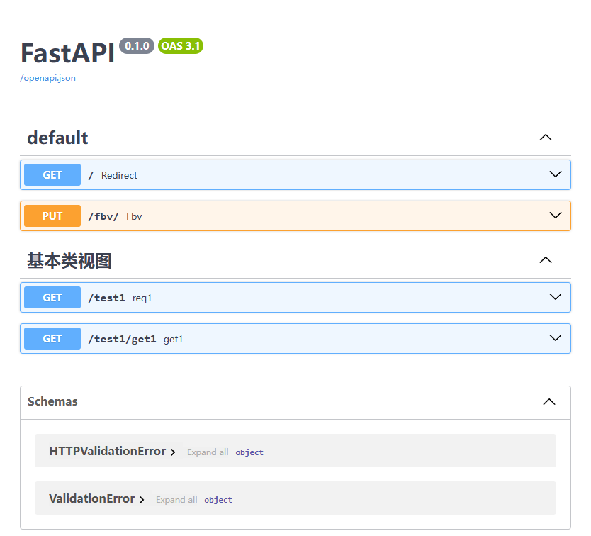

### 嵌套视图

> 类视图可以嵌套，内部的成员类需要用`Prefix`装饰器，表示前缀；

```py
from fastapi import Query
from fastapi_boot import Controller, Get, Prefix, Post


@Controller("/test1", tags=["嵌套类视图"])
class Test1Controller:

    @Get("/get1", summary="get1")
    def get1(self, q: str = Query()):
        return dict(code=200, msg="", data={"q": q})

    # 应该没人这么玩吧.
    @Prefix("/layer1")
    class Layer1:
        @Prefix("/layer2")
        class Layer2:
            @Prefix("/layer3")
            class Layer3:
                @Prefix("/layer4")
                class Layer4:
                    @Prefix("/layer5")
                    class Layer5:
                        @Prefix("/layer6")
                        class Layer6:
                            @Prefix("/layer7")
                            class Layer7:
                                @Prefix("/layer8")
                                class Layer8:
                                    @Prefix("/layer9")
                                    class Layer9:
                                        @Prefix("/layer10")
                                        class Layer10:
                                            @Prefix("/layer11")
                                            class Layer11:
                                                @Prefix("/layer12")
                                                class Layer12:
                                                    @Prefix("/layer13")
                                                    class Layer13:
                                                        @Prefix("/layer14")
                                                        class Layer14:
                                                            @Prefix("/layer15")
                                                            class Layer15:
                                                                @Prefix("/layer16")
                                                                class Layer16:
                                                                    @Prefix("/layer17")
                                                                    class Layer17:
                                                                        @Prefix("/layer18")
                                                                        class Layer18:
                                                                            @Prefix("/layer19")
                                                                            class Layer19:
                                                                                @Prefix("/layer20")
                                                                                class Layer20:
                                                                                    @Post("/layer-route")
                                                                                    def layer_route(
                                                                                        self,
                                                                                    ):
                                                                                        return "You did it!"

```

效果：
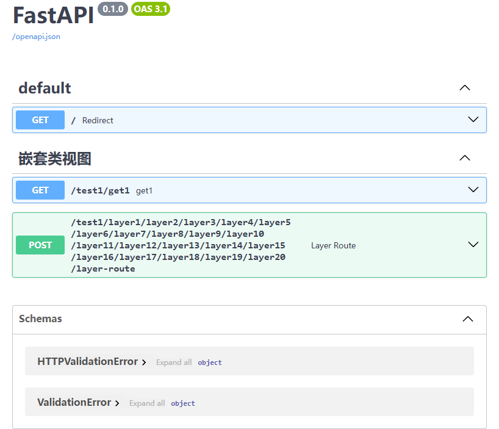

> 先介绍一个函数`usedep`

-   位置：控制器的**静态属性**上
-   扫描时会自动为控制器下**子路由**注入公共依赖，从而避免在有关的每个请求方法上都写

> 成员类的`self`不受父类`self`属性的影响，可以用来提取公共依赖、排除父类依赖；
> 当然，成员类也可以有自己的依赖，并且不会影响父类、同级类和子类

-   下面的例子中，`/foo`和`/bar`都有两个依赖，分别获取`user-agent`和简单验证查询参数`p`，而`/aaa`不受限制

```py
from fastapi import HTTPException, Query, Request

from fastapi_boot import Controller, Get, usedep, Post, Prefix


def get_user_agent(request: Request):
    return request.headers.get("user-agent")


def verify_params(p: str = Query()):
    if len(p) < 3:
        raise HTTPException(status_code=401, detail="p太短")
    return p


# 类视图，Controller类继承APIRouter
@Controller("/test1", tags=["基本类视图"])
class Test1Controller:
    user_agent = usedep(get_user_agent) # [!code ++]
    p = usedep(verify_params) # [!code ++]

    @Get("/foo")
    def foo(self):
        return dict(p=self.p, userAgent=self.user_agent)

    @Post("/bar")
    def bar(self):
        return dict(p=self.p, userAgent=self.user_agent)

    @Prefix()
    class Another:
        @Get("aaa")
        def aaa(self):
            return "success"
```

:::details 效果
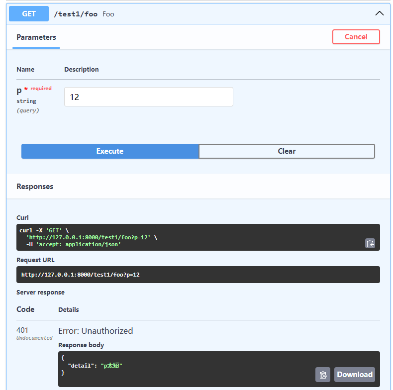 <hr/>
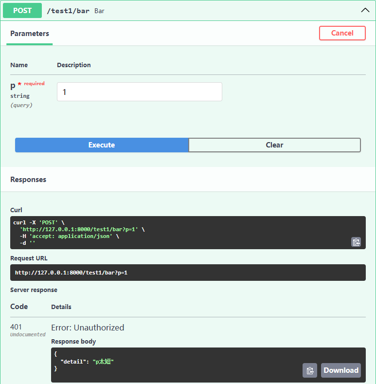 <hr/>
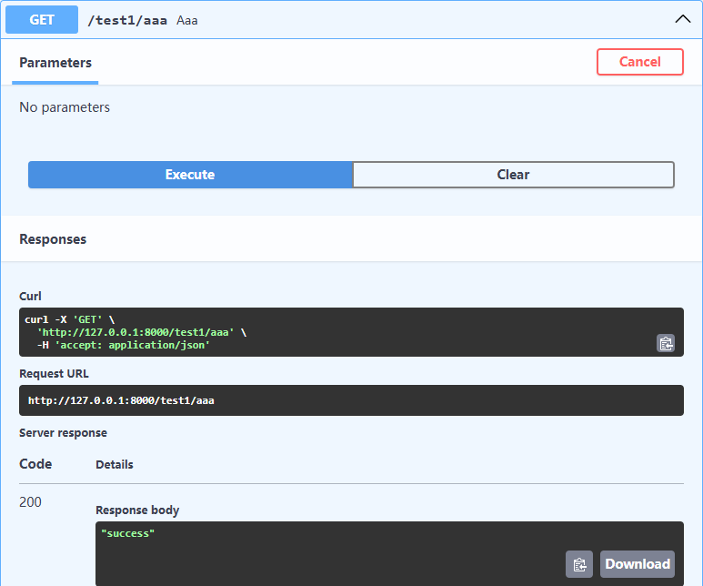 <hr/>
:::

## 2. 依赖注入

### 收集依赖

> 收集依赖：扫描时进行 \
> &emsp;`Injectable`，为了语义化，重命名导出了`Service`、`Repository`、`Component`，这四个一模一样； \
> &emsp;还有一个`Bean`

```py
from fastapi_boot import Service, Repository, Component, Injectable

# 语义化的
@Service
class AnimalService:...
@Repository
class AnimalDAO: ...
@Component
class Xxx: ...
# 更普遍的
@Injectable
class Xxxx: ...


# 或者也可以按依赖名收集，其他的类似
@Service('animal-service1')
class AnimalService:...
# 在这几个上使用依赖名收集似乎没什么用，到Bean上就有用了
```

```py
from pydantic import BaseModel
from fastapi_boot import Bean

class Animal:
    def __init__(self, name: str, age: int = 9) -> None:
        self.name = name
        self.age = age


# 这样就收集了一个类型为Animal的依赖
# Bean装饰的函数如果不写返回值类型，会用type(return_value)推断
@Bean
def get_animal() -> Animal:
    return Animal("animal", 10)


# 使用命名依赖收集多个同类型的依赖，并在之后指定按依赖名注入
class User(BaseModel):
    name: str
    age: int


# name为zhangsan的User
@Bean("zhangsan")
def get_user1():
    return User(name="zhangsan", age=20)

# name为lisi的User
@Bean("lisi")
def get_user2():
    return User(name="lisi", age=21)

# name为wangwu的User
@Bean("wangwu")
def get_user3():
    return User(name="wangwu", age=22)
```

### 注入依赖

> 注入依赖： \
> `Inject`以及它的重命名导出`Autowired`，一模一样；\
> （1）如果在模块顶层或者作为类的静态属性，会在扫描时进行； \
> （2）如果在请求时才运行的函数（`Controller`的`__init__`方法、请求映射方法）中，则请求时才注入（不建议，可能会拖慢速度）；

#### 按类型

-   如果要注入之前的`Animal`，没写名需要按类型注入，写了名按类型和依赖名都行；
-   三种位置注入；
-   可以直接调用或使用`@`运算符进行注入；

:::code-group

```py [service/animal.py]
from fastapi_boot import Service, Inject, Autowired

from bean.beans import Animal

# 模块顶层注入
animal1: Animal = Inject(Animal)
animal2: Animal = Autowired @ Animal
animal3: Animal = Animal @ Inject


@Service
class AnimalService:
    # 静态属性注入
    animal4: Animal = Autowired(Animal)
    animal5: Animal = Inject @ Animal
    animal6: Animal = Animal @ Autowired

    # __init__方法注入
    def __init__(self, animal7: Animal, animal8: Animal):
        self.animal7: Animal = animal7
        self.animal8: Animal = animal8
        self.animal9: Animal = Inject @ Animal

    def is_animal_same(self):
        # 注入的都是同一个Animal实例，返回True
        return (
            animal1
            == animal2
            == animal3
            == self.animal4
            == self.animal5
            == self.animal6
            == self.animal7
            == self.animal8
            == self.animal9
        )
```

```py [controller/animal.py]
from fastapi_boot import Autowired, Get, Controller
from service.animal import AnimalService

@Controller("/animal", tags=["依赖注入"])
class UserController:
    animal_service = Autowired(AnimalService)

    @Get()
    def foo(self):
        return self.animal_service.is_animal_same()
```

:::

目录：
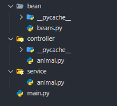
效果：
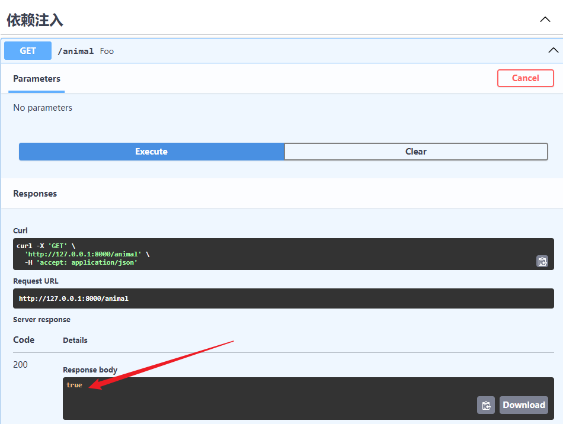

#### 按依赖名

:::code-group

```py [service/user.py]
from typing import Annotated
from fastapi_boot import Service, Inject, Autowired

from bean.beans import User

# 模块顶层注入
user1: User = Autowired(User, "zhangsan")
user2: User = Inject.Qualifier("lisi") @ User
user3: User = User @ Autowired.Qualifier("wangwu")


@Service
class UserService:
    # 静态属性注入
    user4: User = Inject(User, "zhangsan")
    user5: User = Autowired.Qualifier("lisi") @ User
    user6: User = User @ Inject.Qualifier("wangwu")

    # __init__方法注入
    def __init__(self, user7: Annotated[User, "zhangsan"]):
        self.user7: User = user7
        self.user8: User = Inject.Qualifier("lisi") @ User
        self.user9: User = User @ Autowired.Qualifier("wangwu")

    def is_user_same(self):
        return (
            user1 == self.user4 == self.user7
            and user2 == self.user5 == self.user8
            and user3 == self.user6 == self.user9
        ) # True

```

```py [controller/user.py]
from fastapi_boot import Get, Controller

from service.user import UserService


@Controller("/user", tags=["依赖注入"])
class UserController:
    def __init__(self, user_service: UserService) -> None:
        self.user_service = user_service

    @Get()
    def foo(self):
        return self.user_service.is_user_same()

```

:::
目录：
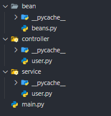
效果：
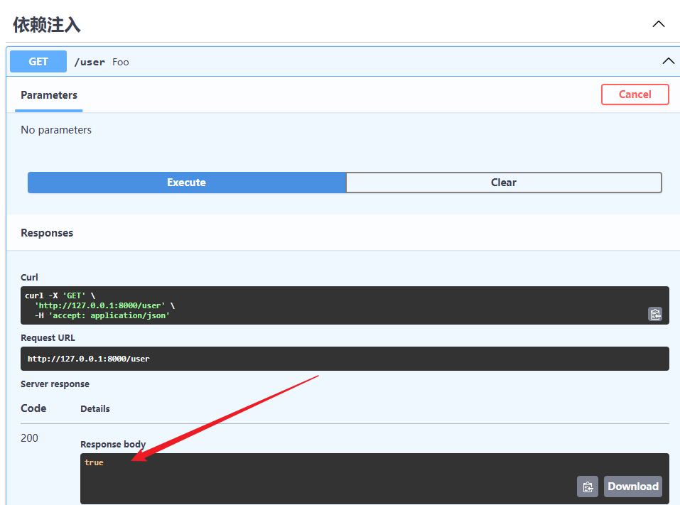

#### tips

1. `Bean`装饰的函数
    - 如果有泛型，确保**以泛型方式**写上`return_annotation`，并按泛型类型注入；
    - 如果不写返回值类型注解，只能推断出外层类型，按类型注入可能会重复，从而报错；
    - 当然也可以写依赖名，按依赖名注入，**遇到复杂点的类型建议通过依赖名注入**；

```py
# bean/beans.py

# 如果他不写返回值类型，只能推断出list，就和后面的两个重复了，之后按类型list注入的时候不知道注入谁
@Bean
def get_str_list() -> list[str]:
    return ["1", "2", "3"]


@Bean
def get_int_str() -> list[int]:
    return [1, 2, 3]


@Bean
def get_animal_list(animal: Animal) -> list[Animal]:
    return [animal for _ in range(3)]

# controller/user.py
@Controller("/animal", tags=["依赖注入"])
class UserController:
    str_list = Inject @ list[str]
    int_list = Inject @ list[int]
    animal_list = Inject @ list[Animal]

    @Get()
    def foo(self):
        return [*self.str_list, *self.int_list, *self.animal_list]
```

效果：
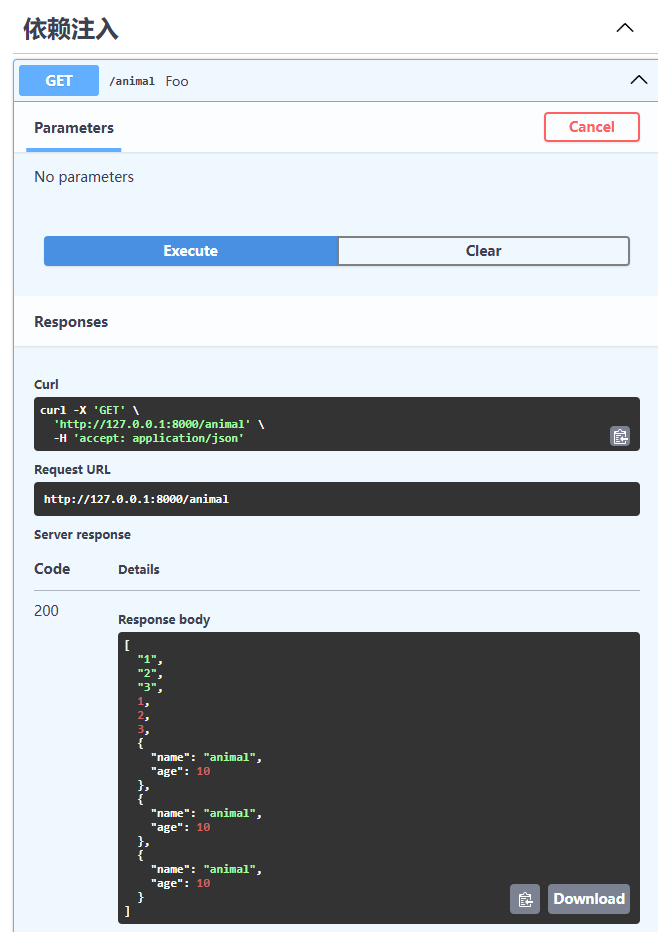

2. 依赖链
    - 收集到的依赖、`Bean`装饰的函数，在实例化、执行的过程中，会尝试注入形参中的依赖；
    - <span class='red'>注意循环引用问题</span>

:::code-group

```py [bean/beans.py]
from typing import Annotated, TypeAlias
from pydantic import BaseModel
from fastapi_boot import Bean


class Biology(BaseModel):
    name: str
    age: int

class Human(Biology): ...

@Bean("zhangsan")
def get_zhangsan():
    return Human(name="zhangsan", age=20)

@Bean("lisi")
def get_lisi():
    return Human(name="lisi", age=21)

# 尽量不要把类型别名的定义放在使用之后，可能会找不到
BiologyList: TypeAlias = list[Biology]

# 注入前面的zhangsan和后面的dog、BiologyList
# 因为前面有个lisi也是Human，所以zhangsan使用依赖名注入
# 而dog只有一个，使用类型注入
@Bean("lisi")
def get_list(zhangsan: Annotated[Human, "zhangsan"], dog: "Dog") -> BiologyList: # [!code ++]
    return [zhangsan, dog]


@Bean
def get_dog(owner: Annotated[Human, "zhangsan"]):
    return Dog(name="wangcai", age=2, owner=owner)


class Dog(Biology):
    owner: Human

```

```py [service/user.py]
from fastapi_boot import Service, Inject
from bean.beans import BiologyList


@Service
class UserService:
    ls = Inject @ BiologyList

    def test(self):
        return self.ls
```

```py [controller/user.py]
from fastapi_boot import Get, Controller
from service.user import UserService


@Controller("/biology-list", tags=["依赖注入"])
class UserController:

    def __init__(self, user_service: UserService) -> None:
        self.user_service = user_service

    @Get()
    def get_list(self):
        return self.user_service.test()
```

:::
效果：
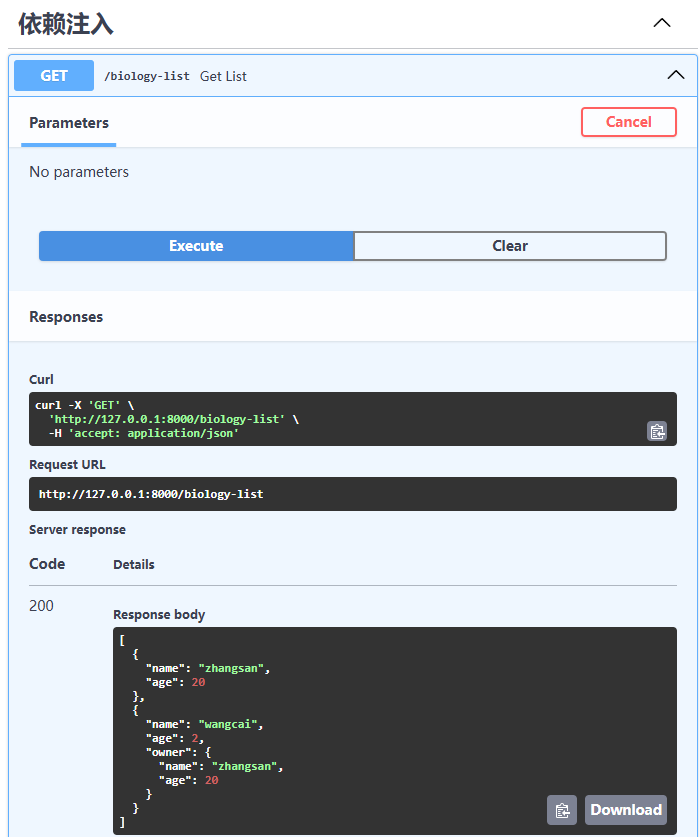

#### 处处可依赖注入

:::code-group

```py [bean/beans.py]
from typing import Annotated, Generic, TypeVar
from pydantic import BaseModel
from fastapi_boot import Bean


class Biology(BaseModel):
    name: str
    age: int

class Human(Biology): ...

@Bean("zhangsan")
def get_zhangsan():
    return Human(name="zhangsan", age=20)

@Bean("lisi")
def get_lisi():
    return Human(name="lisi", age=21)

@Bean
def get_list(zhangsan: Annotated[Human, "zhangsan"], dog: "Dog[int]") -> "Res[str]": # [!code ++]
    return Res(records=[zhangsan, dog])

@Bean
def get_dog(owner: Annotated[Human, "zhangsan"]) -> "Dog[int]": # [!code ++]
    return Dog(name="wangcai", age=2, owner=owner)

# 仅演示泛型依赖注入，无实际类型约束
T = TypeVar("T")

class Dog(Biology, Generic[T]):
    owner: Human

class Res(BaseModel, Generic[T]):
    records: list[Biology]
```

```py [service/user.py]
from typing import Annotated
from bean.beans import Human, Res
from fastapi_boot import Service, Component, Inject


@Service
class UserService:
    res = Inject @ Res[str]

    def __init__(self, a: "A", lisi: Annotated[Human, "lisi"]) -> None:
        self.a = a
        self.lisi = lisi

    def test(self):
        return self.a.name, self.res.records, self.lisi

@Component
class A:
    name = "A"
```

```py [controller/user.py]
from bean.beans import Dog, Res
from fastapi_boot import Get, Controller, Injectable, Autowired
from service.user import UserService


@Controller("/inject-test", tags=["依赖注入"])
class UserController:

    def __init__(self, user_service: UserService, res: Res[str], dog: Dog[int]) -> None:
        self.user_service = user_service
        self.b = Autowired @ B
        self.res = res
        self.dog = dog

    @Get()
    def get_list(self):
        return self.user_service.test(), self.b.name, self.res, self.dog

@Injectable
class B:
    name = "B"
```

:::

效果：
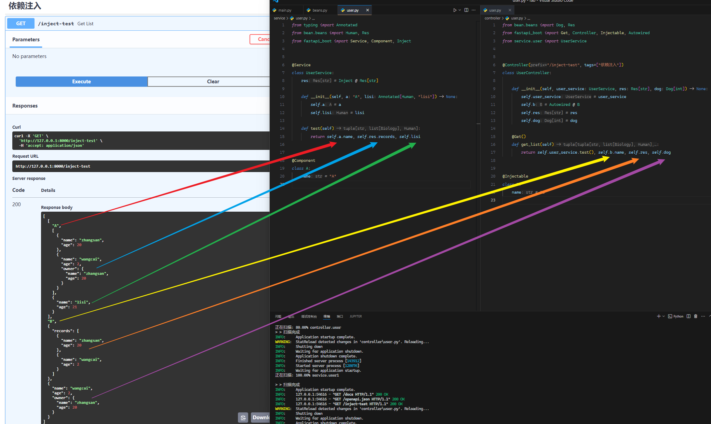

## 3. 项目配置

```py
@asynccontextmanager
async def lifespan(app: FastAPI):
    # 这个位置可以传一些配置
    FastApiBootApplication.run_app(app, config=Config(exclude_scan_path=["fastapi_boot"]))
    yield

# Config类如下
@dataclass
class Config:
    need_pure_api: Annotated[bool, "是否删除自带的api"] = False
    scan_timeout_second: Annotated[int, "扫描超时时间，超时未找到报错"] = 10
    exclude_scan_path: Annotated[list[str], "忽略扫描的模块或包在项目中的点路径"] = field(default_factory=list)
    include_scan_path: Annotated[list[str], "额外扫描的模块或包在项目中的点路径"] = field(default_factory=list)
```

## 4. 所有 API

```py
from fastapi_boot.model.scan_model import Config
from .core.decorator import (
    Controller,
    Bean,
    Injectable,
    FastApiBootApplication,
)
from .core.decorator import (
    Injectable as Service,
    Injectable as Repository,
    Injectable as Component,
)

from .core.helper import Inject, Prefix
from .core.helper import Inject as Autowired
from .core.hook import usedep
from .core.mapping.func import (
    Req,
    Get,
    Post,
    Put,
    Delete,
    Options,
    Head,
    Patch,
    Trace,
    WebSocket as Socket,
)

from .enums import RequestMethodEnum as RequestMethod

```

<span style='color:orange;font-size:20px;font-weight:bold'>更多功能(bug)待探索...</span>
