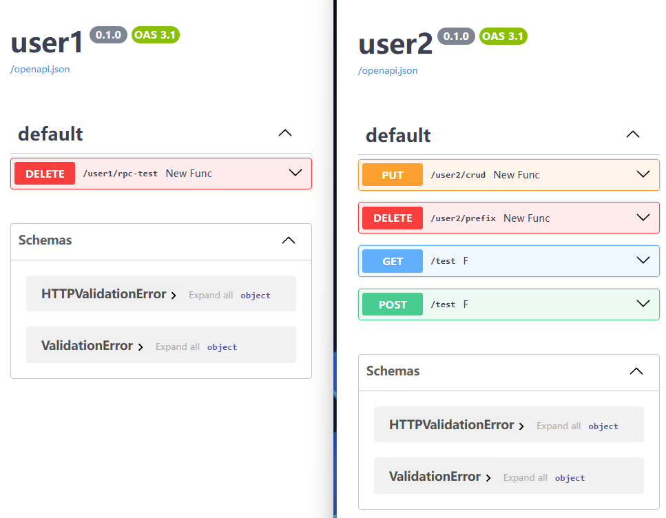
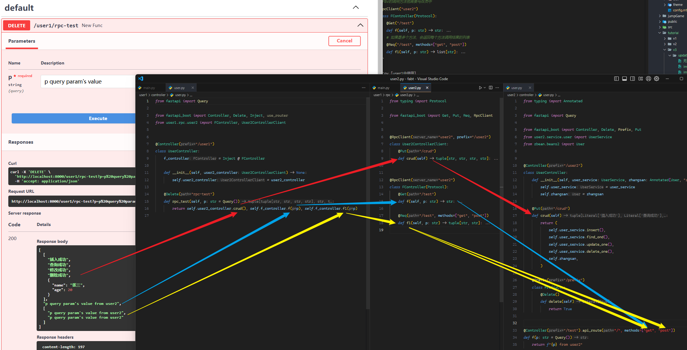
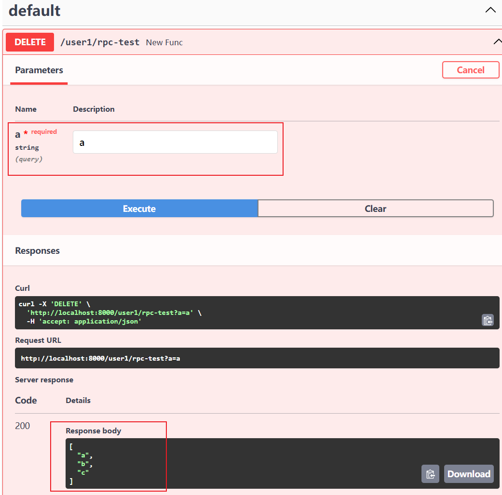
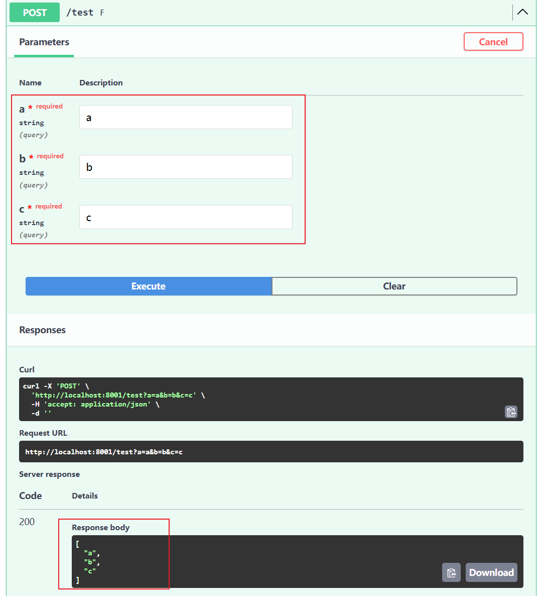

# 1. 现在`Query`的类型可以使用`dataclass`、`BaseModel`

-   如果有多个查询参数，可以抽离，而不用依次写到`endpoint`的参数中，便于其他位置复用；
-   类型是`dataclasa`或`BaseModel`时必须注明`Query`，不然会认为是`Body`

## 1. 用法

```py
# model
@dataclass
class User:
    name1: str
    age: int = 1

# Controller
@Controller("/user")
class UserController:

    @Post()
    def get_user(self, name: str = Query(), user: User = Query()):
        return dict(name=user.name1, age=user.age, another_name=name)
```

效果：


当然，也可以用`Query`的`alias`写成类型别名：

```py
@dataclass
class User:
    name1: str = Query(alias="name")
    age: int = 1
```

效果：


:::warning 注意

1. 查询类的字段名和`endpoint`中单独的查询参数不能重复，如果把`User`的` name`字段改成 `name`：会报以下错误：
   
2. 多个查询类的字段名也不能重复
   
3. 其他类型（比如这里的`Body`则可以和查询参数重名）
   
   :::

:::danger 插个眼
可能还会有若干 bug，遇到再处理
:::

## 2. 实现

1. **请求**，处理`endpoint`的 self 时顺便把参数中类型属于`dataclass`/`BaseModel`且默认值为`Query(xxx)`的参数替换为里面所有字段的`field_name = Query(xxx)`的形式，修改`endpoint`的签名（类查询参数名会加前缀、避免和其他类型的参数重名），这样请求时会把对应字段加到查询参数中；
2. **响应**，用新函数替换原函数，新函数中在获取到参数值时，把属于之前替换参数的参数`pop`出来，构造好对应的数据类实例，再加到参数中，最后调用原`endpoint`，返回结果。

大致原理：
.png>)

# 2. 关于 rpc 的一点尝试

## 1. 思路

:::warning 问题

-   之前的`use_router`虽然可以控制要挂载哪些路由，但挂载后就像 app 中本来就有一样，不能精确控制挂载后的行为；

:::

:::tip 解决

-   通过一个类似<a target='_blank' href='https://spring.io/projects/spring-cloud-openfeign'>`OpenFeign`</a>调用的方式，声明式地写上要注入的服务名、前缀、方法和请求路径，通过依赖注入使用；从而在多个服务之间互相调用

:::

## 2. 例子

:::code-group

```py [user2 controller]
from typing import Annotated

from fastapi import Query

from fastapi_boot import Controller, Delete, Prefix, Put
from user2.service.user import UserService
from zbean.beans2 import User


@Controller("/user2")
class UserController:
    def __init__(self, user_service: UserService, zhangsan: Annotated[User, "zhangsan"]) -> None:
        self.user_service = user_service
        self.zhangsan = zhangsan

    @Put("/crud")
    def crud(self):
        return (
            self.user_service.insert(),
            self.user_service.find_ond(),
            self.user_service.update_one(),
            self.user_service.delete_one(),
            self.zhangsan,
        )

    @Prefix("/prefix")
    class PrefixCls:
        @Delete()
        def delete(self):
            return True


@Controller("/test").api_route("/", methods=["get", "post"])
def f(p: str = Query()):
    return f"{p} from user2"
```

```py [app2]
from fastapi_boot import Config, FastApiBootApplication

# 配置server_name以开启rpc
config = Config(include_scan_paths=["service", "zbean.beans2", "dao.user"], server_name="user2") # [!code ++]
app = FastApiBootApplication.config(config).app_config(title="user2").build()
```

:::

:::code-group

```py [app1]
from fastapi_boot import Config, FastApiBootApplication

# 还是和之前的例子一样
config = Config(exclude_scan_paths=["zbean"], include_scan_paths=["zbean.a.b.c", "service"])
app = FastApiBootApplication.config(config).app_config(title="user1").build()
```

```py [user1]
from typing import Protocol

from fastapi_boot import Get, Put, Req, RpcClient

# 可以选择继承Protocol也可以不继承
# 方法不需要实现，实现也会被user2服务的对应方法替换，
# 不要写__init__，不支持注入其他依赖，该类仅作为类型就好
# 通过path + method查找方法，其他参数仅作user1中调用时的类型提示
# 不写Query、Path等默认值，因为这里的调用不会经过fastapi处理，不会根据具体类型替换具体参数

# 传入server_name和prefix
@RpcClient(server_name="user2", prefix="/user2")
class User2ControllerClient:
    @Put("/crud")
    def crud(self) -> tuple[str, str, str, str]: ...

# FBV的调用方法也需要写在类中，嫌麻烦就没有为FBV单独写方法，
# 路径和请求方法相同的方法可以重复，只要确保方法名不同就行
@RpcClient("user2")
class FController(Protocol):
    @Get("/test")
    def f(self, p: str) -> str: ...
    # 如果是多个方法，会返回每个方法调用结果的列表
    @Req("/test", methods=["get", "post"])
    def f1(self, p: str) -> list[str]: ...
```

```py [user1中使用]
from fastapi import Query

from fastapi_boot import Controller, Delete, Inject, use_router
from user1.rpc.user2 import FController, User2ControllerClient

# 正常注入即可
@Controller("/user1")
class UserController:
    f_controller = Inject @ FController

    def __init__(self, user2_controller: User2ControllerClient) -> None:
        self.user2_controller = user2_controller

    @Delete("rpc-test")
    def rpc_test(self, p: str = Query()):
        return self.user2_controller.crud(), self.f_controller.f(p), self.f_controller.f1(p)
```

:::

效果：


<hr/>

调用过程：


## 3. 更多玩法

> 只要保证最终调用 endpoint 时参数传递正确，中间过程可任意传，如下：

```py
# app2中endpoint定义时这么写
@Controller("/test").api_route("/", methods=["get", "post"])
def f(a: str, b: str = Query(), c: str = Query()):
    return a, b, c


# app1中定义RpcClient时这么写
@RpcClient("user2")
class FController(Protocol):

    @Req("/test", methods=["post"])
    def f1(self, a: str, b: str, c: str = Query(default='c')) -> list[str]: ...


# app2中调用rpc时这么写
@Controller("/user1")
class UserController:
    f_controller = Inject @ FController

    @Delete("rpc-test")
    def rpc_test(self, a: str = Query()):
        b='b'
        return self.f_controller.f1(a, b)
```

:::details 远程调用

-   总共有三个参数 a、b、c，其中：
    1. a 来自调用 rpc 的请求方法的查询参数；
    2. b 来自调用 rpc 的请求方法内的变量；
    3. c 来自定义 rpc 的协议`FController`；

只需传递一个`a`查询参数：

:::

:::details 本地调用

-   需要传递 a、b、c 三个参数
    

:::

> 这样不会限制协议类一定和对应的本地方法的参数相同，只需要最终参数正确就行；

不定期找&修复 bug
