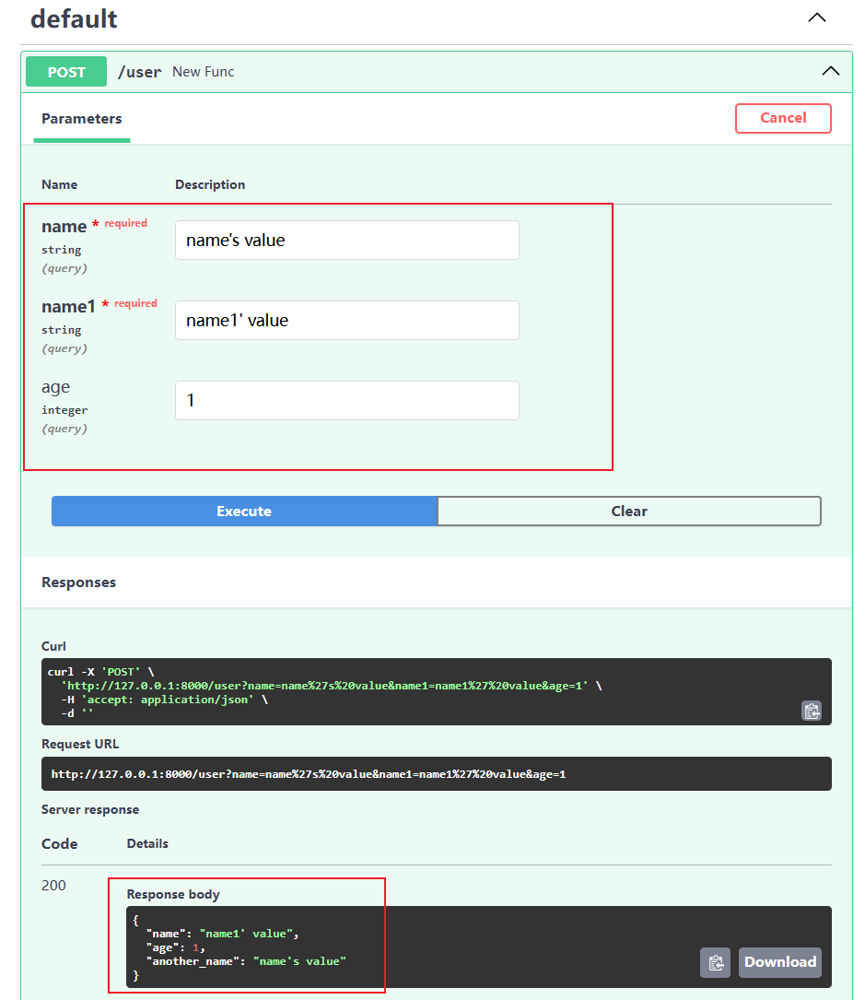
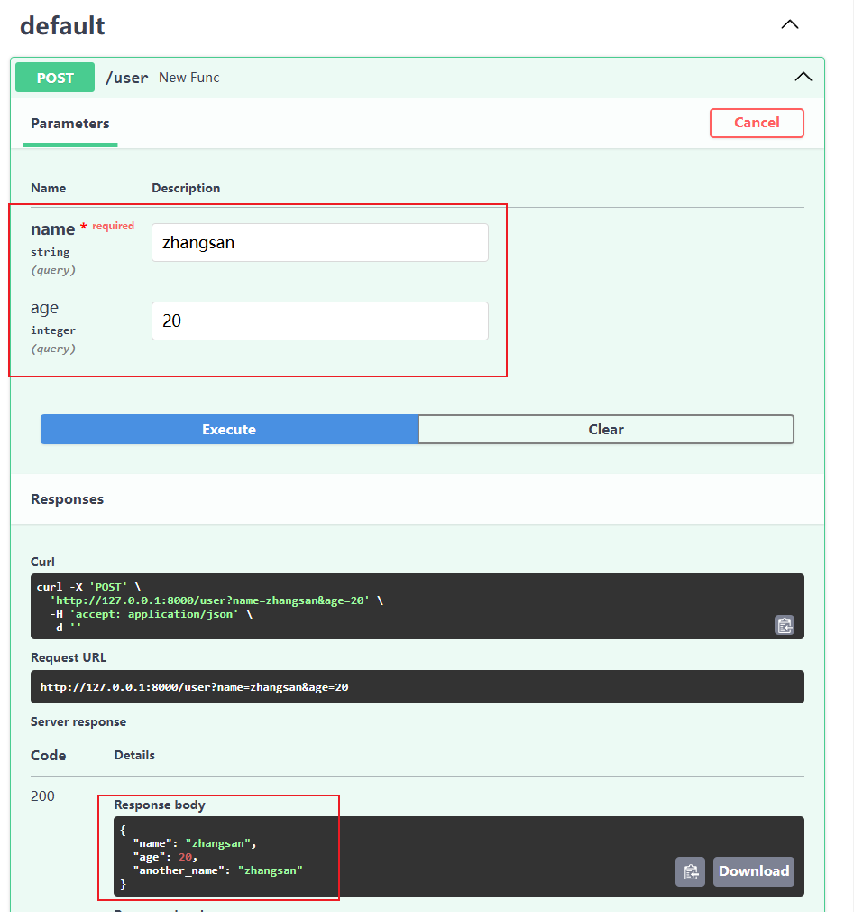
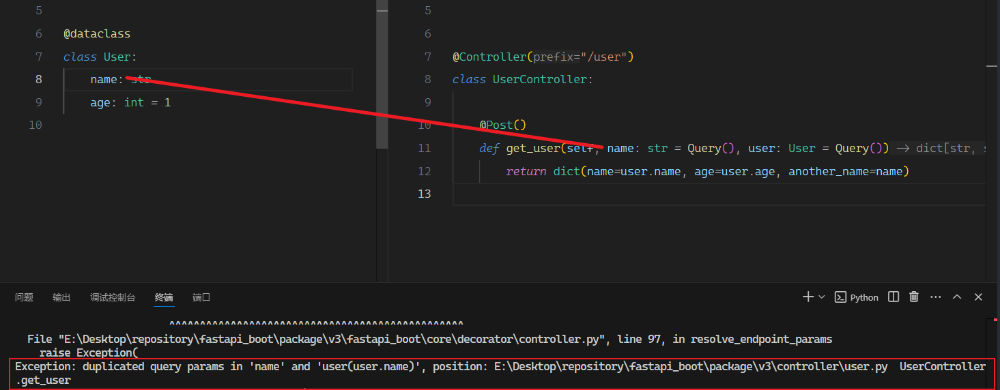
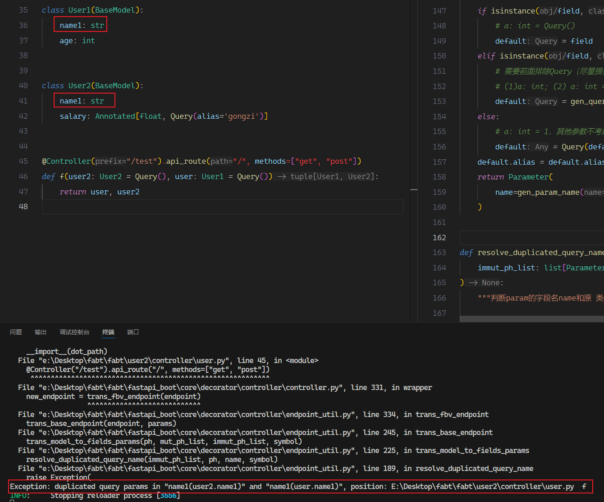
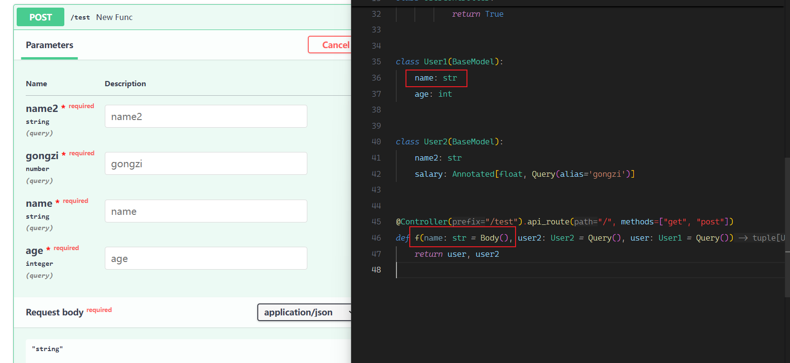

# 1. 现在`Query`的类型可以使用`dataclass`、`BaseModel`

-   如果有多个查询参数，可以抽离，而不用依次写到`endpoint`的参数中，便于其他位置复用；
-   类型是`dataclasa`或`BaseModel`时必须注明`Query`，不然会认为是`Body`

## 1. 用法

```py
# model
@dataclass
class User:
    name1: str
    age: int = 1

# Controller
@Controller("/user")
class UserController:

    @Post()
    def get_user(self, name: str = Query(), user: User = Query()):
        return dict(name=user.name1, age=user.age, another_name=name)
```

效果：


当然，也可以用`Query`的`alias`写成类型别名：

```py
@dataclass
class User:
    name1: str = Query(alias="name")
    age: int = 1
```

效果：


:::warning 注意

1. 查询类的字段名和`endpoint`中单独的查询参数不能重复，如果把`User`的` name`字段改成 `name`：会报以下错误：
   
2. 多个查询类的字段名也不能重复
   
3. 其他类型（比如这里的`Body`则可以和查询参数重名）
   
   :::

:::danger 插个眼
可能还会有若干 bug，遇到再处理
:::

## 2. 实现

1. **请求**，处理`endpoint`的 self 时顺便把参数中类型属于`dataclass`/`BaseModel`且默认值为`Query(xxx)`的参数替换为里面所有字段的`field_name = Query(xxx)`的形式，修改`endpoint`的签名（类查询参数名会加前缀、避免和其他类型的参数重名），这样请求时会把对应字段加到查询参数中；
2. **响应**，用新函数替换原函数，新函数中在获取到参数值时，把属于之前替换参数的参数`pop`出来，构造好对应的数据类实例，再加到参数中，最后调用原`endpoint`，返回结果。

大致原理：
.png>)

